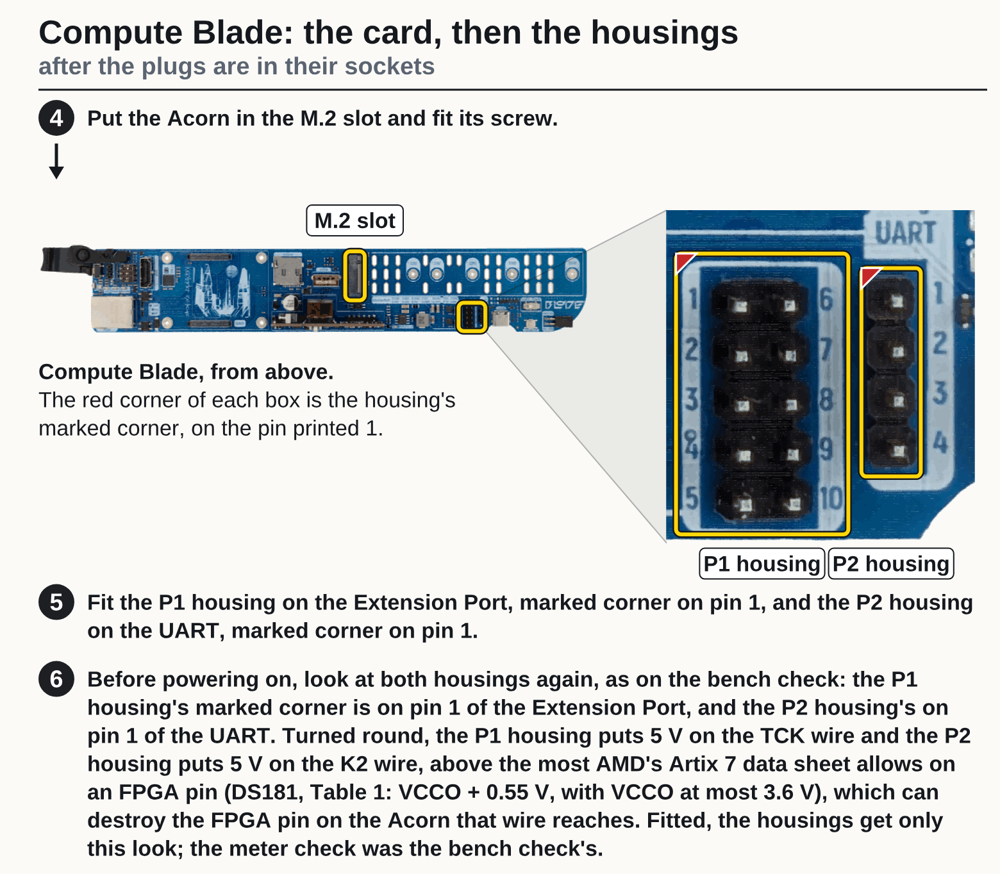

# Taking pi20 at ps1's old serial wiring off

**You are about to fit the guide's P2 cable on pi20 at ps1 and need its old serial wiring off without losing
its P1 (JTAG) cable.** What each blade still needs is on [Acorns at ps1](ps1.md).

Its serial pair is wired straight to GPIO14 (J2) and
GPIO15 (K2), with no resistor: read with the pin-ID design on 31 August 2026, when a design driving J2 stopped
JTAG until a PoE cycle, so J2 and P1's TMS share GPIO14 (fpgas.online-test-designs issue 4, the comment of
2026-08-31). GPIO14 is on Extension Port pin 9 and on UART header pin 3 (Uptime Lab's GPIO guide).

**Which numbering these are.** "Extension Port pin 9" and "UART header pin 3" are the Compute Blade's own
numbers, the ones printed on the blade beside its two headers (the silkscreen, seen in the picture below), and drawn on the right of the
picture captioned "Compute Blade: the card, then the housings" on the Fitting sheet (headed "Compute Blade
cables: fitting"; it is reproduced below). They are not the Raspberry Pi's 40-pin numbers: on the Raspberry
Pi's 40-pin header GPIO14 is pin 8, and the blade's pin 9 is that header's pin 8. If you know the Pi's
numbers, do not count by them here. On the Extension Port, pin 1 is at the top of the left column and pin 6
at the top of the right, so pins 1 to 5 run down the left column and 6 to 10 down the right; pin 9 is the
fourth from the top in the right column, and pin 10 the last. On the UART header pin 1 is the top one and
pin 4 the bottom one, with pin 3 the third. Which GPIO each pin carries (pin 9 and GPIO14, for one) is from Uptime Lab's GPIO guide, not measured by us.

{.only-light}
{.only-dark}

Which Extension Port and UART pins
the old serial wires sit on, and whether J2 shares a terminal or a housing with P1's TMS wire, is
not recorded by us. Build a new P2 cable by the guide ([UART connector
1](../building/compute-blade/uart-connector-1.md) and 2) first. Then ask Tim, and power the blade off (unplug its PoE cable,
and a USB-C cable if one is plugged in), take the card out of its M.2 slot (touch bare metal of the unplugged blade first, and hold the card by its
edges, as on the cable pages), and look at Extension Port pins 9 and
10 and UART header pins 3 and 4: note which housing sits where.

1. Take the old serial wiring off the blade and the card. If a serial wire shares a housing, a terminal or a
   splice with P1's TMS wire, do not cut or pull it: take P1's cable off with it, and build a new P1 cable by the
   guide ([JTAG connector 1](../building/compute-blade/jtag-connector-1.md) and 2).
2. Otherwise take P1's housing off its header and its plug out of the card's socket P1 too, and check it as
   [JTAG connector 2](../building/compute-blade/jtag-connector-2.md) steps 3 and 4 do: each plug contact beeps to its
   cavity and to no other, and contact 6 (VCC, 3.3 V from the Acorn) beeps to no cavity at all: in the guide's
   cable its wire is cut off short and insulated ([JTAG connector 1](../building/compute-blade/jtag-connector-1.md)
   step 5): look at it, a short stub with tube over its cut end. The bench check cannot tell whether wire 6 reaches
   a header pin, so this look and the meter are what keep its 3.3 V off the host. If any of this fails, or the housing is not the guide's 2×5, build a new P1 cable.
3. Run the [bench check](../building/compute-blade/bench-check.md) with the new P2 cable and the P1 cable, kept or
   new, the card still out, as that page says. Its ground beep is meant to show that no housing is turned round (that a turned housing would
   then stay silent is not tried by us, as that page says).
4. Then fit both cables and the card as [Fitting](../building/compute-blade/fitting.md) does. Whether P1's TMS
   works is shown only by the check's `jtag` test, in a boot with the header's serial port off ([verifying
   3](../building/compute-blade/verifying-3.md)); the meter cannot reach it with the card fitted.
