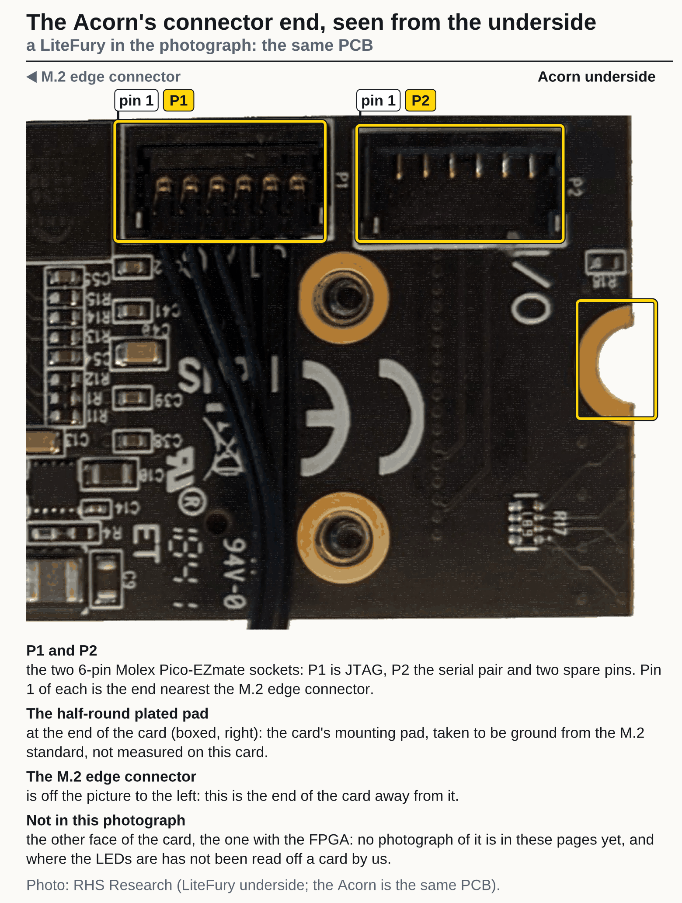
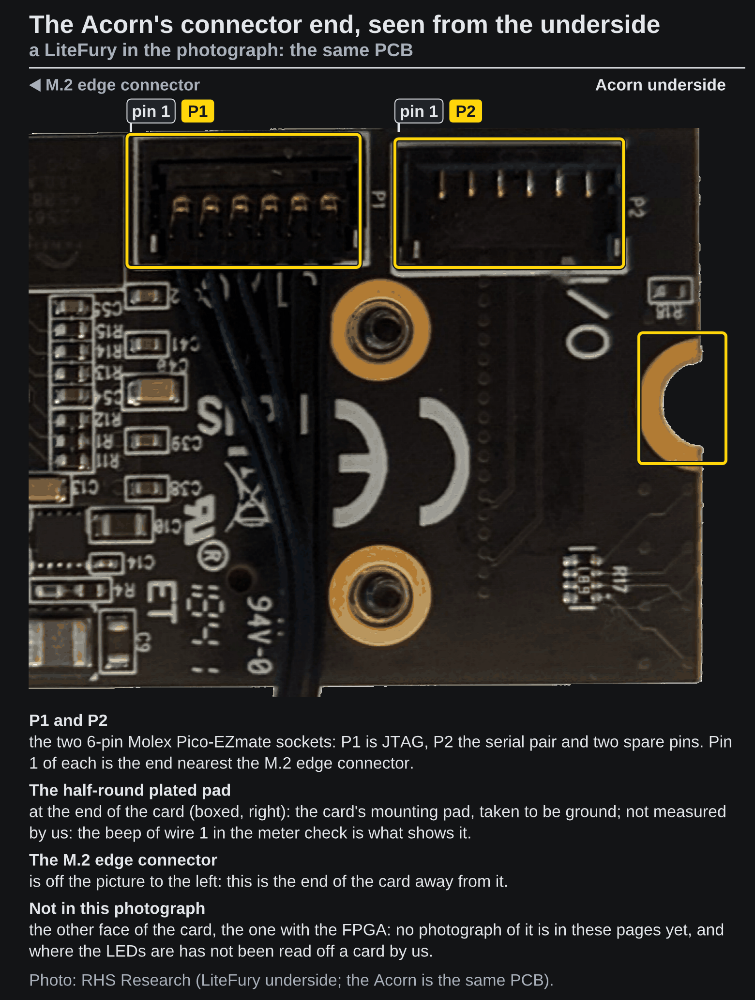

# The Acorn card

**You have a SQRL Acorn CLE-215+, CLE-215 or CLE-101 (or a LiteFury or NiteFury) and want to know what is on
the card: its FPGA, its PCIe interface, clock, LEDs, serial pins, flash and memory.** What differs between
the cards of the family is on [Acorn variants](../which-one.md); the two connectors and their wires
are on the wiring pages, [on a Raspberry Pi 5](../setup/rpi-5/wiring.md) and [on a Compute
Blade](../setup/compute-blade/wiring.md).

## The card

{.only-light}
{.only-dark}

The photograph shows the connector end of the underside, which is the end the two cables plug into.

The figures and the pins of each part are on [Acorn specifications](specifications.md).
