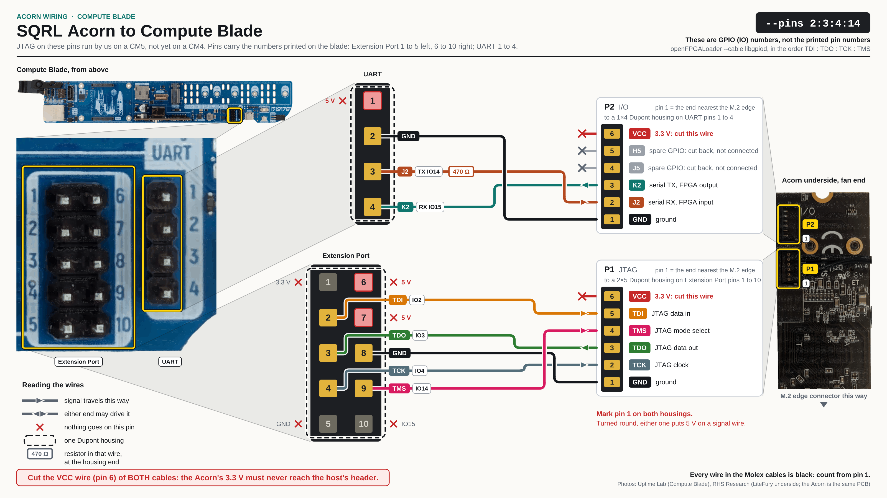
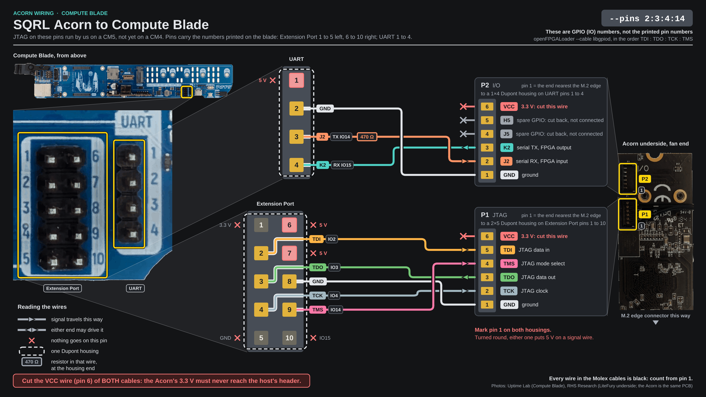

# Acorn wiring on a Compute Blade

This page is for someone with an Acorn in a [Compute Blade](https://computeblade.com/) with a CM4 or CM5, which has no 40-pin header. It lists which wire of the card's two connectors goes to which pin of the blade's Extension Port and UART header. The blade's settings are on [the blade's pins and settings](blade-settings.md).

Why JTAG and the serial pair share a line is on [The line JTAG and the serial port share on a Compute Blade](shared-line.md). An Acorn on a Raspberry Pi 5 is wired differently and has [its own page](../rpi-5/wiring.md). To build and fit the cables, follow [The two cables on a Compute Blade](cables.md).

## The wiring sheet

[](../../generated/acorn-wiring-computeblade.svg){.only-light}
[](../../generated/acorn-wiring-computeblade-dark.svg){.only-dark}

The `--pins` numbers on the sheet are GPIO numbers, not printed pin numbers. Select the sheet for the full-size drawing.

```{include} ../../inc/board-connectors.inc
```

## Pin numbering

Each row of the table is a header of the blade, the pin numbers it prints, and how they relate to a Raspberry Pi header. This page uses the printed numbers, not Raspberry Pi header numbers. TX and RX on the UART header are named from the blade's side. Every pin of the two headers is listed under [the blade's connectors and their GPIOs](blade-settings.md#the-blades-connectors-and-their-gpios).

| Header | Printed pins | Electrically |
|--------|--------------|--------------|
| Extension Port (printed "Extention Port") | 1 to 5 in one column, 6 to 10 in the other | Raspberry Pi header pins 1-10, in the same arrangement |
| UART header (the vendor's "UART Back") | 1 to 4 | not Raspberry Pi header pins |

## P1: JTAG, on the Extension Port

Each row is one wire: a P1 pin, its Extension Port pin, GPIO and direction, resistor and shared line.

```{include} ../../generated/acorn-blade-p1.md
```

## P2: serial pair, on the UART header

Each row is one wire: a P2 pin, its UART pin, GPIO and direction, resistor and shared line. The 470 Ω resistor is soldered into the J2 wire near its housing end. Why it is there: [The line JTAG and the serial port share on a Compute Blade](shared-line.md). Fitting it: [How to prepare the UART cable's wires (Compute Blade)](uart-wires.md).

```{include} ../../generated/acorn-blade-p2.md
```

## Housings

Each row of the table is the Dupont housing of one connector and the cavities that stay empty. No cavity holds two wires.

| Connector | Housing | Covers | Cavities that stay empty |
|-----------|---------|--------|--------------------------|
| P1, on the Extension Port | 2×5 | the whole port | 1, 5, 6, 7 and 10 |
| P2, on the UART header | 1×4 | the whole header | 1 |

:::{warning}
**Extension Port pins 6 and 7 and UART pin 1 are 5 V and sit inside a housing. Their cavities must stay empty.** A housing turned round puts a wire there. Mark pin 1 on each housing and match it to printed pin 1.
:::

When a wire does not answer: [Acorn wiring faults on a Compute Blade](../../troubleshooting/compute-blade-wiring.md).
