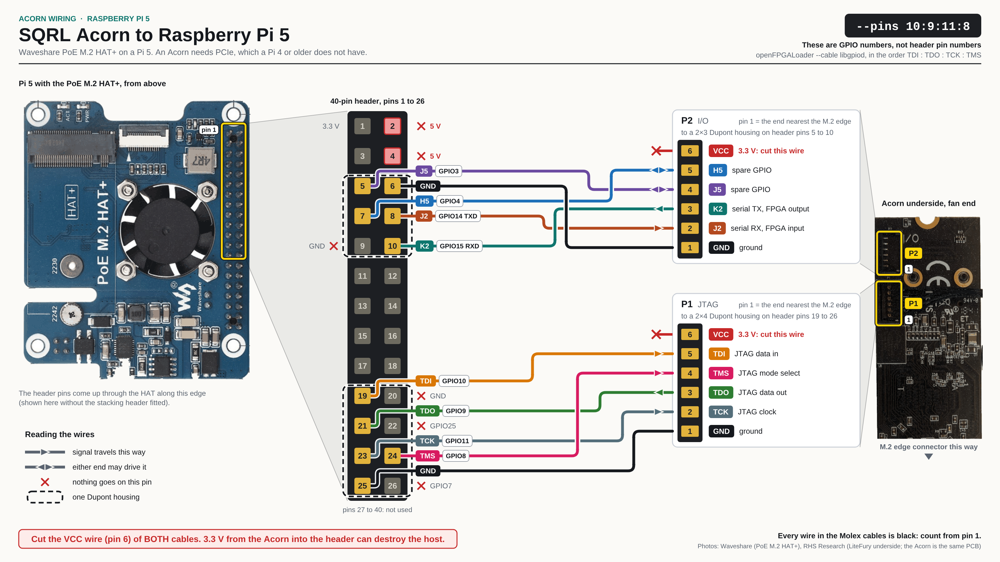
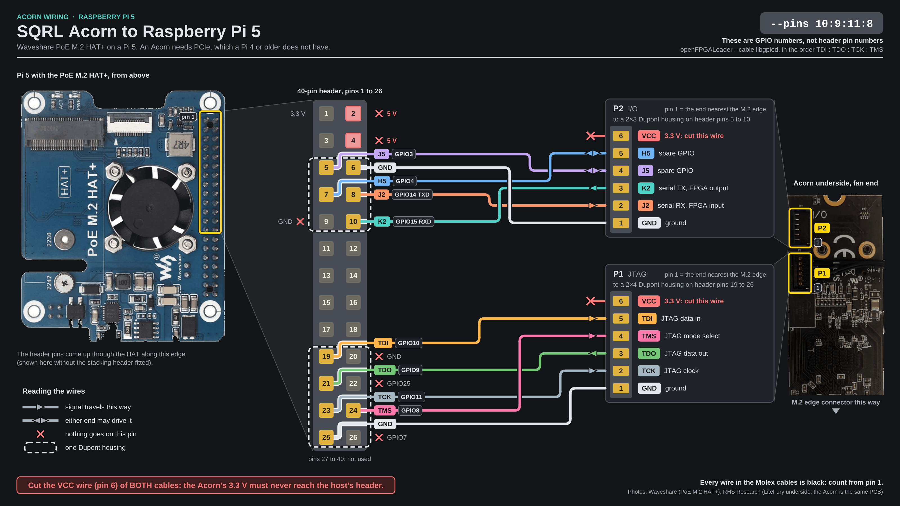

# Acorn wiring on a Raspberry Pi 5

This page is for someone with an Acorn on a Raspberry Pi 5 with an M.2 HAT. It lists which wire of the card's two connectors goes to which pin of the Pi's 40-pin header. The settings the Pi needs for those wires are on [the Pi's settings](pi-settings.md). An Acorn in a Compute Blade is wired differently and has [its own page](../compute-blade/wiring.md). To build and fit the cables, follow [The two cables on a Raspberry Pi 5](cables.md).

## The wiring sheet

[](../../generated/acorn-wiring-pi5.svg){.only-light}
[](../../generated/acorn-wiring-pi5-dark.svg){.only-dark}

The `--pins` numbers at the top right of the sheet are GPIO numbers, not header pin numbers. A dashed outline is one Dupont housing, and a red cross is a pin or a wire that nothing goes on. Select the sheet for the full-size drawing.

```{include} ../../inc/board-connectors.inc
```

## P2: serial pair and spare GPIOs

P2 goes to a 2×3 Dupont housing on header pins 5-10, and the cavity over pin 9 (GND) stays empty. Each row is one wire: a P2 pin, the header pin it lands on, its GPIO and the direction.

```{include} ../../generated/acorn-pi5-p2.md
```

## P1: JTAG

P1 goes to a 2×4 Dupont housing on header pins 19-26. The cavities over pins 20 (GND), 22 (GPIO25) and 26 (GPIO7) stay empty. Each row is one wire: a P1 pin, the header pin it lands on, its GPIO and the direction.

```{include} ../../generated/acorn-pi5-p1.md
```

When a wire does not answer: [Acorn wiring faults on a Raspberry Pi 5](../../troubleshooting/rpi-5-wiring.md).
