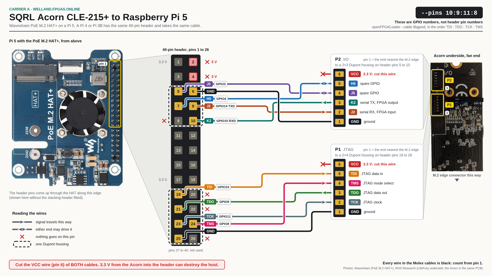

# Acorn wiring

Pinmap and step-by-step wiring instructions for connecting a SQRL Acorn
CLE-215+ (or LiteFury/NiteFury) to its Raspberry Pi host in the fpgas.online
test infrastructure. See [SQRL Acorn and LiteFury](index.md) for board specs
and deployment inventory.

This is the canonical Acorn-to-Pi wiring, and it comes in two variants. Which
one applies is a property of the **carrier the Pi sits in** — how many GPIOs it
brings out — and not of the site: either carrier can appear in either room.

- **Raspberry Pi 5 with the M.2 HAT** — the full 40-pin header is available, so
  P2 plugs into header pins 5-10 and P1 into header pins 19-26. JTAG gets its
  own pins, `--pins 10:9:11:8` (TDI:TDO:TCK:TMS), the serial pair sits on
  GPIO14/15, and both spare balls (J5, H5) are wired. Driving the FPGA's
  transmitter does not cost you JTAG. This is the variant described first
  below.
- **[Compute Blade carrier with a CM4 or CM5](#compute-blade-wiring-variant)** —
  the expansion port exposes only GPIO2, 3, 4, 14 and 15, so both connectors
  land there and JTAG is `--pins 2:3:4:14`. Three pins carry two wires each
  (GPIO3 = TDO + J5, GPIO4 = TCK + H5, GPIO14 = TMS + J2), and the P2 wire of
  each pair goes through a 470 Ω resistor so that JTAG always wins.

All four P2 wires land on the same GPIOs on both carriers — K2 (FPGA TX) to
GPIO15, J2 (FPGA RX) to GPIO14, J5 to GPIO3, H5 to GPIO4 — so one set of FPGA
pin constraints and one set of host scripts serves every host. Only the JTAG
pins differ.

:::{note}
**Pinout locked 2026-09-20.** Two things changed on this page that day, and
both matter if you built a cable from an earlier revision:

- **Connector pin numbers are now the physical ones.** Earlier revisions
  numbered the signals 1 to 6 in a made-up order (P2: K2, J2, J5, H5, GND, VCC;
  P1: TCK, TDI, TDO, TMS, GND, VCC) that does not match the connector, whose
  pin 1 is GND on both. Every "P1:n" and "P2:n" below is now the position in
  the Pico-EZmate housing, per the vendor legend under [Board
  Connectors](#board-connectors). The signal-to-GPIO mapping did not change,
  so a cable that works is still right; a cable crimped by counting positions
  from the old tables is not.
- **The Compute Blade variant now wires J5 and H5** and adds the three series
  resistors. No blade has been rewired to it yet; see [Measured state of the
  Compute Blade hosts](#measured-state-of-the-compute-blade-hosts).
:::

:::{note}
**Revised 2026-09-03.** The P2 serial wiring below was corrected after the
pin-ID design was run on the Welland boards on 2026-08-31 (see [Measured P2
wiring](#measured-p2-wiring-on-raspberry-pi-5-hosts)). The earlier revision of
this page — and both site pages until 2026-09-03, which recorded K2 straight
through to GPIO14 and called the crossover a PS1 peculiarity — wired FPGA TX
(K2) to the Pi's TXD0, i.e. transmitter into transmitter, which cannot work with
the hardware UART (`/dev/ttyAMA0`) that every host and test script uses. The
crossover is the fleet standard, not a Compute Blade special case.
:::

## Wiring Diagram



Connector pins are drawn in their physical order and header pins carry the
numbers printed on the board in the picture. Both sheets on this page are
generated by `tools/acorn_wiring/gen.py`, which refuses to build if any label
leaves its box or a pad leaves its header; change the pin tables there, not the
picture. The board photos are the vendors' own (credited on each sheet).

:::{note}
The original hand-drawn Google Drawings ([RPi 5
wiring](https://docs.google.com/drawings/d/1HCOHrvFzj1fIf6DqDMzcqoQgjaD5ZvM39MtgvrAjqEU/edit),
[Compute Blade
wiring](https://docs.google.com/drawings/d/1hKt7O_IR60R6uT8VOg2O9PEAp4a8fNmp7BFqi3YYjgQ/edit))
are being brought into line with these sheets so the two can be cross-checked.
Until that is done they still show the pre-2026-08-31 straight-through serial
pair and the Compute Blade one puts TMS on GPIO15; where they disagree with this
page, this page is right. Their connector legend reads "UART RX (K2)" and "UART
TX (J2)": that is the **host's** point of view (K2 is what the host receives),
and its arrows are correct. K2 is the FPGA's transmitter.
:::

:::{warning}
**The VCC (3.3V) wire on both P1 and P2 must NEVER be connected to the RPi
header.** Leave VCC wires unconnected or clipped. Connecting VCC between the
Acorn and RPi can damage the RPi's power management chip.
:::

## Bill of Materials

| Item | Description | Qty |
|------|-------------|-----|
| Sqrl Acorn CLE-215+ | M.2 M-key PCIe FPGA accelerator | 1 |
| Raspberry Pi 5 | 8 GB recommended | 1 |
| M.2 PCIe HAT for RPi 5 | M.2 M-key to RPi PCIe adapter that leaves the 40-pin header usable (the sheet above shows a Waveshare PoE M.2 HAT+) | 1 |
| Molex Pico-EZmate cable (6-pin) | [Molex 0369200601](https://www.digikey.fr/en/products/detail/molex/0369200601/10233018) | 1 |
| 2×3 Dupont housing (2.54 mm) + crimp terminals | P2 (UART/GPIO) end on a Pi 5 | 1 |
| 2×4 Dupont housing (2.54 mm) + crimp terminals | P1 (JTAG) end on a Pi 5; on a Compute Blade one 2×4 takes both cables | 1 |
| 470 Ω resistor, 1/8 W axial | Compute Blade only: in series with J2, J5 and H5 | 3 |
| Solder + heat shrink | For cable termination | — |

## Board Connectors

The Acorn exposes two 6-pin Molex Pico-EZmate connectors. Both are on the
**underside** of the card (the face without the FPGA and heatsink), side by side
along one long edge at the **fan end**, the end away from the M.2 edge
connector. The silkscreen beside them reads `I/O` / `P2` and `JTAG` / `P1`; P2 is
the one nearer the end of the card. The user LEDs are on the other face.

- **P1**: JTAG (programming and debug)
- **P2**: Serial / GPIO (UART and spare I/O)

Pin 1 of each connector is the end **nearest the M.2 edge connector**, and it is
GND on both:

```{rst-class} nowrap
```

| Pin | P2 (I/O)                  | P1 (JTAG) |
|-----|---------------------------|-----------|
| 1   | GND                       | GND       |
| 2   | J2 — serial RX, FPGA input  | TCK       |
| 3   | K2 — serial TX, FPGA output | TDO       |
| 4   | J5 — spare GPIO 0           | TMS       |
| 5   | H5 — spare GPIO 1           | TDI       |
| 6   | VCC 3.3 V — **cut**         | VCC 3.3 V — **cut** |

Sources: the "Pico-EZmate connectors pinout on Acorn, Nite/LiteFury" legend on
the [LiteX Acorn CLE-215
wiki](https://github.com/enjoy-digital/litex/wiki/Use-LiteX-on-the-Acorn-CLE-215)
(it names K2 and J2 from the host's side, "UART RX (K2)"), and the silkscreen of
RHS Research's 14-pin JTAG adapter (GND, TCK, TDO, TMS, TDI, VCC), both read
2026-09-20. The JTAG order is confirmed in service by pi20 at PS1, whose cable
was built from that legend and answers `--detect`. The order has not been
checked with a meter on a bare card.

Take one Pico-EZmate cable (plug at each end), cut it in half. This gives two
cables — one for P1, one for P2. Strip ~3 mm of insulation from each wire.
**All six wires in the Molex cable are black**, so there is no colour to go by:
count positions from pin 1, and buzz each wire through before crimping.

## P2: Serial / UART + GPIO (2×3 header → RPi pins 5-10)

The P2 connector provides UART and 2 spare GPIO pins. Solder or crimp Dupont
connectors onto a **2×3 pin header** arranged to plug into RPi header pins 5-10.

### FPGA Pins

| P2 Pin | FPGA Pin | Function                    | I/O Standard |
|--------|----------|-----------------------------|--------------|
| 1      | GND      | Ground                      | —            |
| 2      | J2       | Serial RX (FPGA input)      | LVCMOS33     |
| 3      | K2       | Serial TX (FPGA drives)     | LVCMOS33     |
| 4      | J5       | Spare GPIO 0                | LVCMOS33     |
| 5      | H5       | Spare GPIO 1                | LVCMOS33     |
| 6      | VCC      | 3.3V — cut, never connected | —            |

### RPi GPIO Header Connection (P2)

The serial pair is a **null-modem crossover**: the FPGA's transmitter (K2) lands
on the Pi's receiver (GPIO15 / RXD0) and the FPGA's receiver (J2) on the Pi's
transmitter (GPIO14 / TXD0). This follows the Raspberry Pi header convention
(pin 8 = TXD, pin 10 = RXD) that `/dev/ttyAMA0` uses on every Pi generation,
and it is the same convention the NeTV2 boards use ([NeTV2 primary
UART](../netv2.md#primary-uart-via-rpi-gpio): FPGA TX → GPIO15,
FPGA RX → GPIO14).

How hard that convention is depends on the host:

- **BCM2711 / BCM2837 hosts (Pi 3, Pi 4, CM4):** the PL011 mux is fixed —
  GPIO14 can only be a UART transmitter and GPIO15 only a receiver — so the
  crossover is the one wiring that can work.
- **RP1 hosts (Pi 5, CM5):** the hardware UART0 is likewise only offered as
  GPIO14 = `TXD0`, GPIO15 = `RXD0` (`pinctrl funcs 14,15` on pi-sw2-p29 lists
  no alt where they swap), so a non-crossover cable cannot use `/dev/ttyAMA0`
  either. But the RP1 also exposes `PIO14`/`PIO15` (`/dev/pio0`, `rp1_pio`
  module loaded on the fleet), and a PIO UART program can put TX or RX on any
  header pin — see the PIO note under [Compute Blade pin
  mapping](#pin-mapping). Nobody has written that driver for
  the test scripts, so the fleet standardises on the crossover and one cable
  design works on every host.

```text
RPi 40-pin header (top view, showing pins 3-12):

                       Pin 3     Pin 4
                      (GPIO2)   (  5V  )
                    ┌────────────────────┐
P2:4 J5 (spare 0) ← │  Pin 5     Pin 6   │ → P2:1 GND
                    │ (GPIO3)   ( GND  ) │
                    │                    │
P2:5 H5 (spare 1) ← │  Pin 7     Pin 8   │ → P2:2 Serial RX (J2)
                    │ (GPIO4)   (GPIO14) │     Pi TXD0 → FPGA
                    │                    │
     (empty)        │  Pin 9     Pin 10  │ → P2:3 Serial TX (K2)
                    │ ( GND )   (GPIO15) │     FPGA → Pi RXD0
                    └────────────────────┘
                      Pin 11     Pin 12
                     (GPIO17)   (GPIO18)
```

:::{warning}
**P2 pin 6 (VCC 3.3V) must be left UNCONNECTED.** Clip or insulate the VCC wire.
The housing cavity over RPi header pin 9 stays empty.
:::

| P2 Pin | Function     | FPGA Pin | → RPi Header Pin | RPi GPIO | BCM Function | Direction        |
|--------|--------------|----------|-------------------|----------|--------------|------------------|
| 1      | GND          | —        | Pin 6             | GND      | —            | —                |
| 2      | Serial RX    | J2       | Pin 8             | GPIO14   | TXD0         | Pi → FPGA        |
| 3      | Serial TX    | K2       | Pin 10            | GPIO15   | RXD0         | FPGA → Pi        |
| 4      | Spare GPIO 0 | J5       | Pin 5             | GPIO3    | I2C1_SCL     | either           |
| 5      | Spare GPIO 1 | H5       | Pin 7             | GPIO4    | GPCLK0       | either           |
| 6      | VCC (3.3V)   | —        | **unconnected**   | —        | —            | —                |

| Parameter | Value                                                                 |
|-----------|-----------------------------------------------------------------------|
| Device    | `/dev/ttyAMA0` (RP1 uart0; see the Pi 5 note below)                   |
| Baud rate | 115200                                                                |
| Pre-test  | `systemctl stop serial-getty@ttyAMA0` (already inactive on the fleet) |

**Pi 5 needs an explicit overlay for this UART.** `bcm2712-rpi-5-b.dtb` ships the
RP1 header UART (`serial0`) as `status="disabled"`, and `dtoverlay=disable-bt`
— which frees the header UART on Pi 0–4 as a side effect — resolves to
`disable-bt-pi5.dtbo` on a Pi 5, whose only fragment targets `bluetooth`. So
without `[pi5] dtoverlay=uart0-pi5` in `config.txt` there is no `/dev/ttyAMA0`
at all. Enabling it also makes the firmware resolve `console=serial0` to
`ttyAMA0`, which would put the kernel console (and its getty) on the FPGA's
serial pins — see [Kernel console
SysRq](#known-issue-kernel-console-sysrq-on-the-fpga-uart) — so the Pi 5s are
pinned to `console=ttyAMA10` (the dedicated debug connector) via `[pi5]
cmdline=cmdline-pi5.txt`. Both are applied to the Welland NFS root by
[fpgas.online-infra
PR #32](https://github.com/fpgas-online/fpgas.online-infra/pull/32) (rolled out
2026-08-30) and asserted by its `verify-pi.yml --tags uart` play. Verified live
2026-09-03 on all six Welland Acorn hosts: `/dev/ttyAMA0` present,
`console=ttyAMA10`, `serial-getty@ttyAMA0` inactive. The same three facts are
summarised under [Raspberry Pi 5](../../setup/pi.md#raspberry-pi-5).

:::{warning}
**Hazard — never drive a Pi GPIO against an FPGA output.** With the pin-ID
design loaded every P2 ball is an FPGA *output* (J2 included), so setting GPIO14
to `a4` (TXD0) or `op` while pin-ID is running is output-vs-output contention on
the J2 wire. Doing exactly that crashed **both** pi-sw2-p47 and pi-sw2-p48
instantly on 2026-08-31 (p47 needed a PoE cycle). Probe with
`pinctrl set 14 ip pn` (input, no pull) and only restore `pinctrl set 14 a4`
once a design that treats J2 as an input is loaded.
:::

## P1: JTAG (2×4 header → RPi pins 19-26)

The P1 connector provides standard Xilinx JTAG signals. Solder or crimp Dupont
connectors onto a **2×4 pin header** arranged to plug into RPi header pins
19-26. Only 5 of the 8 header positions are connected — pin 20 (GND), pin 22
(GPIO25), and pin 26 (GPIO7) are unused, and the VCC wire is left unconnected.

### FPGA JTAG Pins

| P1 Pin | Function | Signal Direction |
|--------|----------|------------------|
| 1      | GND      | —                |
| 2      | TCK      | RPi → FPGA       |
| 3      | TDO      | FPGA → RPi       |
| 4      | TMS      | RPi → FPGA       |
| 5      | TDI      | RPi → FPGA       |
| 6      | VCC      | 3.3V — cut, never connected |

### RPi GPIO Header Connection (P1)

```text
RPi 40-pin header (top view, showing pins 17-28):

               Pin 17     Pin 18
              ( 3.3V )   (GPIO24)
            ┌─────────────────────┐
 P1:5 TDI ← │  Pin 19      Pin 20 │   (empty)
            │ (GPIO10)   ( GND  ) │
            │                     │
 P1:3 TDO ← │  Pin 21     Pin 22  │   (empty)
            │ (GPIO9 )   (GPIO25) │
            │                     │
 P1:2 TCK ← │  Pin 23     Pin 24  │ → P1:4 TMS
            │ (GPIO11)   (GPIO8 ) │
            │                     │
 P1:1 GND ← │  Pin 25     Pin 26  │   (empty)
            │ ( GND  )   (GPIO7 ) │
            └─────────────────────┘
               Pin 27     Pin 28
              (GPIO0 )   (GPIO1 )
```

:::{warning}
**P1 pin 6 (VCC 3.3V) must be left UNCONNECTED.** Clip or insulate the VCC wire.
The housing cavities over RPi header pins 20, 22 and 26 stay empty.
:::

| P1 Pin | Function   | FPGA Pin | → RPi Header Pin | RPi GPIO | BCM Function |
|--------|------------|----------|-------------------|----------|--------------|
| 1      | GND        | —        | Pin 25            | GND      | —            |
| 2      | TCK        | JTAG     | Pin 23            | GPIO11   | SPI0_SCLK    |
| 3      | TDO        | JTAG     | Pin 21            | GPIO9    | SPI0_MISO    |
| 4      | TMS        | JTAG     | Pin 24            | GPIO8    | SPI0_CE0     |
| 5      | TDI        | JTAG     | Pin 19            | GPIO10   | SPI0_MOSI    |
| 6      | VCC (3.3V) | —        | **unconnected**   | —        | —            |

JTAG signals are mapped to the RPi's SPI0 pins for compatibility with
openFPGALoader's SPI-based JTAG transport. On Pi 0–4 the SPI kernel modules must
be unloaded before use (`rmmod spidev spi_bcm2835`). On the Pi 5 fleet this is
not needed — `pinctrl` shows GPIO8–11 as `none` (unclaimed) even with the
modules loaded — but it is harmless.

### Pi 5: openFPGALoader and `gpiochip0`

The 40-pin header on a Pi 5 is **`/dev/gpiochip15`** on the deployed kernel
(6.12.x: only `gpiochip11`–`gpiochip15` exist; verified 2026-09-03). The
Welland NFS root ships Debian's openFPGALoader **v0.10.0**, whose libgpiod
backend opens `/dev/gpiochip0` unconditionally and fails with:

```text
JTAG init failed with: Unable to open gpio chip
```

Workaround used in the field (devtmpfs, so it vanishes on reboot):

```console
$ sudo ln -sfn /dev/gpiochip15 /dev/gpiochip0
```

The proper fix is a newer openFPGALoader: v0.12+ adds the `rp1pio` cable
(RP1 PIO-driven JTAG) and v0.13.1 (already on the PS1 blades) adds
`--read-dna`, `--read-xadc` and `--read-register`, all read-only. Shipping the
`openfpgaloader-rp1pio` build from
[mithro/rp1-jtag](https://github.com/mithro/rp1-jtag) in the NFS root is
[fpgas.online-infra
PR #48](https://github.com/fpgas-online/fpgas.online-infra/pull/48) (open; blocked
on the package reaching the apt repo).

`--detect` is read-only and safe to run against a live PCIe endpoint. Loading a
bitstream is not — see the PCIe detach rule under [Step 2](#step-2-test-jtag-programming)
and [detach the PCIe endpoint before any JTAG
reconfiguration](pcie-programming.md#detach-the-pcie-endpoint-before-any-jtag-reconfiguration).

## Assembly

1. Plug the P1 Pico-EZmate connector into the Acorn's **P1** (JTAG) socket.
2. Plug the P2 Pico-EZmate connector into the Acorn's **P2** (Serial/GPIO) socket.
3. Route the cables so they don't obstruct the M.2 connector or the PCIe edge fingers.
4. Mount the M.2 PCIe HAT onto the RPi 5.
5. Insert the Acorn into the M.2 M-key slot. Push firmly until fully seated; secure with retention screw.
6. Plug the **P2 header** (2×3) into RPi header pins 5-10.
7. Plug the **P1 header** (2×4) into RPi header pins 19-26.
8. Double-check orientation and verify VCC wires are not connected.

**Important**: buzz every wire of your specific Pico-EZmate cable through with a
multimeter before connecting. The six wires are all black, a cable cut in half
gives two ends whose pin 1 is on opposite sides, and nothing on the plug is
numbered: pin 1 is whichever wire lands nearest the M.2 edge connector once the
plug is seated.

## Verification

### Step 1: Boot and Verify PCIe

```console
$ lspci -nn -s 0001:01:00.0
# Factory Sqrl firmware in flash:
#   0001:01:00.0 Processing accelerators [1200]: Squirrels Research Labs Acorn CLE-215+ [1e24:021f]
# The vendor (RHS Research) XDMA sample image in flash (pi20; pi-sw2-p44 shows the same ID):
#   0001:01:00.0 Processing accelerators [1200]: Xilinx Corporation 7-Series FPGA Hard PCIe block (AXI/debug) [10ee:7011]
# A LiteX x1 PCIe design:
#   0001:01:00.0 Memory controller [0580]: Xilinx Corporation Device [10ee:7021]
```

If the Acorn doesn't appear: check M.2 seating, FPC cable, `dmesg | grep -i pci`.

### Step 2: Test JTAG Programming

:::{warning}
**Detach the PCIe endpoint before every JTAG reconfiguration.** Reconfiguring
the FPGA while its endpoint is enumerated is a surprise removal that the
BCM2712 root complex does not survive: on 2026-08-31 it crashed pi-sw2-p47
outright mid-load (SSH dropped, Pi rebooted). With the endpoint removed first
the same load completes cleanly and the host is unaffected.
:::

```console
# 0. Detach the endpoint (bring it back as in Step 5, or just reboot)
$ echo 1 | sudo tee /sys/bus/pci/devices/0001:01:00.0/remove
# openFPGALoader 0.10.0 on Pi 5 only
$ sudo ln -sfn /dev/gpiochip15 /dev/gpiochip0
# 1. Read-only sanity check (safe even without step 0)
$ openFPGALoader --cable libgpiod --pins 10:9:11:8 --detect
# Expected: idcode 0x3636093 (XC7A200T; the .bit header reads 7a200tfbg484)
# 2. Load to SRAM (volatile). Pin order: TDI(GPIO10):TDO(GPIO9):TCK(GPIO11):TMS(GPIO8)
# ~16 s for a 1.6 MB XC7A200T bitstream over bit-banged libgpiod (measured 2026-08-31)
$ openFPGALoader --cable libgpiod --pins 10:9:11:8 <bitstream.bit>
# With the rp1pio build (openFPGALoader 0.12+, infra PR #48):
$ openFPGALoader -c rp1pio --pins 10:9:11:8 <bitstream.bit>
```

Never pass `--write-flash` here: SRAM loads are lost on power cycle, so a
reboot always restores whatever is in flash, which makes every experiment safe.
See [Acorn PCIe programming and multiboot](pcie-programming.md) for the flash
story.

:::{warning}
**Files staged under `/home/pi` do not survive a reboot.** The Pi root is
`overlayroot=tmpfs` on a read-only NFS root. The symptom is openFPGALoader
printing `Open file … FAIL` in under 0.1 s — re-copy the bitstream.
:::

### Step 3: Test UART and GPIO

```console
$ sudo systemctl stop serial-getty@ttyAMA0
$ sudo systemctl mask serial-getty@ttyAMA0
# Program the loopback bitstream (detach PCIe first, see Step 2)
$ openFPGALoader --cable libgpiod --pins 10:9:11:8 gpio-loopback-acorn.bit
# Test UART (loopback inverts)
$ stty -F /dev/ttyAMA0 115200 raw -echo
$ echo "test" > /dev/ttyAMA0
# Test GPIO (loopback inverts). The header is gpiochip15 on a Pi 5 (line N == GPIO N).
$ gpioset gpiochip15 3=1
$ gpioget gpiochip15 4
# Expected: 0 (inverted)
```

### Step 4: Test PMOD Pin ID

```console
$ openFPGALoader --cable libgpiod --pins 10:9:11:8 pmod-pin-id-acorn.bit
# Each pin transmits its FPGA ball name at 1200 baud. With correct wiring:
# GPIO15 → "K2" (serial TX, on the Pi's RXD0)
# GPIO14 → "J2" (serial RX, on the Pi's TXD0)
# GPIO3  → "J5" (spare GPIO 0)
# GPIO4  → "H5" (spare GPIO 1)
```

Only GPIO15 can be a hardware UART receiver on a Pi 5, so decode the other
three from sampled GPIO values ([the repository's pin-ID host
scanner](https://github.com/fpgas-online/fpgas.online-test-designs/blob/main/designs/pmod-pin-id/host/identify_pmod_pins.py)
bit-bangs 1200 baud over gpiod and finds the header chip by label, so it works
on a Pi 5) or from `gpiomon` edge timestamps (833 µs per bit against nanosecond
stamps). Keep GPIO14 as an input throughout — see the hazard above. Validate the
method on a positive control before trusting a negative: drive a spare Pi GPIO
and confirm the monitor sees it. The design itself is described under
[Verifying wiring with the pin-id design](../pin-id.md).

:::{note}
**Historical note:** the Acorn pin-ID design had no clock until [test-designs
PR #10](https://github.com/fpgas-online/fpgas.online-test-designs/pull/10) (merged
2026-08-31). The Acorn's default clock is the differential 200 MHz `clk200` pair
(J19/H19), which migen's implicit default-clock wiring cannot turn into a usable
`sys` clock, so the design built, configured and every pin sat idle — which read
as "cable not connected" and hid the real wiring for a day. Use the release
bitstreams built after that fix.
:::

### Step 5: Test PCIe Bitstream

```console
$ echo 1 | sudo tee /sys/bus/pci/devices/0001:01:00.0/remove   # detach first
$ openFPGALoader --cable libgpiod --pins 10:9:11:8 pcie-acorn.bit
# A rescan is not enough for a LiteX design: re-probe the slot's root complex
$ echo 1000110000.pcie | sudo tee /sys/bus/platform/drivers/brcm-pcie/unbind
$ echo 1000110000.pcie | sudo tee /sys/bus/platform/drivers/brcm-pcie/bind
$ lspci -nn -d 10ee:
# Expected: Xilinx Corporation Device [10ee:7021] (LitePCIe's default for one lane)
```

Why, and what was measured, is under [Bring the endpoint back after a JTAG
load](pcie-programming.md#bring-the-endpoint-back-after-a-jtag-load). Proven on
pi20 on 2026-09-20 with the `acorn-pcie` SoC: Gen2 x1, 10000 register round trips
through BAR0 without an error, and the same ident and device DNA over PCIe as
over the UART bridge.

## Measured P2 wiring on Raspberry Pi 5 hosts

Measured 2026-08-31 on the six Welland Acorn hosts, which are the Pi 5 carriers
deployed today ([SQRL Acorn CLE-215+](../../sites/welland.md#sqrl-acorn-cle-215)
for their addresses and models).

Read off each wire with the fixed pin-ID bitstream
(`pmod-pin-id_acorn-cle-215p_vivado-vivado_sqrl_acorn.bit`, see [prebuilt Vivado
bitstreams](pcie-programming.md#prebuilt-vivado-bitstreams)): GPIO15 decoded
through `/dev/ttyAMA0`, the other three lines decoded in software from `gpiomon`
edge timestamps.

| Host       | GPIO14 | GPIO15 | GPIO3 | GPIO4 | Verdict                                              |
|------------|--------|--------|-------|-------|------------------------------------------------------|
| pi-sw2-p29 | J2     | K2     | dead  | H5    | Serial pair correct; **J5 wire dead** (0 edges)       |
| pi-sw2-p46 | J2     | K2     | J5    | H5    | Correct                                              |
| pi-sw2-p48 | J2     | K2     | J5    | H5    | Correct                                              |
| pi-sw2-p47 | K2     | J2     | H5    | J5    | **Both pairs transposed** — reversed connector        |
| pi-sw2-p43 | —      | —      | —     | —     | Not testable: JTAG scans an empty chain (see below)   |
| pi-sw2-p44 | —      | —      | —     | —     | Not testable: JTAG scans an empty chain (see below)   |

- **p47 fix:** transpose *both* pairs (K2↔J2 and J5↔H5) so that K2 → GPIO15,
  J2 → GPIO14, J5 → GPIO3, H5 → GPIO4. This is **not** a 180° re-seat of the
  2×3 header — rotating it maps pin 5↔10 and 7↔8, which does not give the
  target. Only the serial pair is functionally critical; the J5/H5 order is
  cosmetic.
- **p43 / p44:** both enumerate on PCIe (p43 with the Sqrl factory ID, p44
  with `10ee:7011`), but `openFPGALoader --detect` reports `found 0 devices`
  on both, so nothing can be loaded. The P1 (JTAG) cable or its wiring needs
  a physical check; the same "TCK has no pull-up when P1 is unmated" test
  applies, since that pull-up is the Acorn's own (see [Measured state of the
  Compute Blade hosts](#measured-state-of-the-compute-blade-hosts) for a worked
  example).
- P2 was previously believed to be unconnected on these boards; that
  conclusion came from the clockless pin-ID design and was wrong.

All three faults are tracked on the Welland site page under [Known
faults](../../sites/welland.md#known-faults).

Before the pin-ID run, a zero-risk passive check gives the same answer with no
bitstream loaded: toggle the Pi's internal pull-up then pull-down on each line
and see whether it follows. A ~50 kΩ internal pull loses to any real driver, so
a line that follows is floating (far end is an FPGA input, i.e. J2), and a line
that stays put is driven (far end is an FPGA output, i.e. K2). Do not read
GPIO2/GPIO3 this way — they are SDA1/SCL1 and carry board pull-ups.

**Device DNA needs openFPGALoader 0.13 or newer, not a particular carrier.**
The hosts surveyed above run 0.10.0, which has no `--read-dna`, and a
hand-rolled `ISC_ENABLE` + `ISC_DNA` openocd sequence returned
`ffffffffffffffff` on both configured and unconfigured devices while
IDCODE/USERCODE read fine. The value therefore has to wait for the
openFPGALoader upgrade ([infra
PR #48](https://github.com/fpgas-online/fpgas.online-infra/pull/48)); on hosts
already running 0.13.1 `--read-dna` works first time.

## Compute Blade Wiring Variant

The [Compute Blade](https://computeblade.com/) carrier board for CM4/CM5 does
**not** expose the full RPi 40-pin GPIO header. Only a subset of GPIOs are
available on physical connectors. This requires a different pin mapping from the
standard RPi 5 wiring above.


### Available Connectors

| Connector | GPIOs | Physical Pins |
|-----------|-------|---------------|
| Expansion Port (2×5) | GPIO2, GPIO3, GPIO4, GPIO14, GPIO15 | printed 1-10, see below |
| UART Front (3-pin) | GPIO14, GPIO15 | TX, RX, GND |
| UART Back (4-pin) | GPIO14, GPIO15 | printed 1 5V, 2 GND, 3 TX, 4 RX |
| Fan Unit (4-pin) | GPIO12, GPIO13 | PWM0/UART5-TX, PWM1/UART5-RX |

GPIO14/15 are shared across the Expansion Port, UART Front, and UART Back — they
are the same electrical lines. GPIO8-11 (SPI0) are **not** exposed on the
Compute Blade. GPIO2 and GPIO3, which carry TDI and TDO here, are also SDA1 and
SCL1 and have the carrier's onboard I²C pull-ups on them.

Source: [Compute Blade GPIO
documentation](https://docs.computeblade.com/blade/guides/gpio)

### Expansion Port numbering

The blade prints its own numbers beside the port — **1 to 5 down the left
column, 6 to 10 down the right** — and a legend above it ("Extention Port 1 3.3V
2 IO2 …"). They are **not** Raspberry Pi header numbers, although the ten pins
are electrically RPi header pins 1-10 in the same physical arrangement. This
page uses the printed numbers, because those are the ones in front of you at
the bench. Read off the vendor's board photo on 2026-09-20.

| Printed pin | Silkscreen | GPIO            | Same pin on an RPi header |
|-------------|------------|-----------------|---------------------------|
| 1           | 3.3V       | —               | 1                         |
| 2           | IO2        | GPIO2 (SDA1)    | 3                         |
| 3           | IO3        | GPIO3 (SCL1)    | 5                         |
| 4           | IO4        | GPIO4           | 7                         |
| 5           | GND        | —               | 9                         |
| 6           | 5V         | —               | 2                         |
| 7           | 5V         | —               | 4                         |
| 8           | GND        | —               | 6                         |
| 9           | IO14       | GPIO14 (TXD0)   | 8                         |
| 10          | IO15       | GPIO15 (RXD0)   | 10                        |

### Pin Mapping

Both P1 (JTAG) and P2 (UART/GPIO) go to one 2×4 Dupont housing that sits on
printed pins 2-5 and 7-10. Three cavities hold two wires each.

```text
Compute Blade Expansion Port, printed numbers, seen from above:

                       1 (3.3V)     6 (5V)
                     ┌──────────────────────────┐
 P1:5 TDI          ← │  2 (IO2)     7 (5V)      │   EMPTY — 5 V, nothing goes here
                     │                          │
 P1:3 TDO          ← │  3 (IO3)     8 (GND)     │ → P1:1 GND
 P2:4 J5 via 470 Ω ← │                          │
                     │                          │
 P1:2 TCK          ← │  4 (IO4)     9 (IO14)    │ → P1:4 TMS
 P2:5 H5 via 470 Ω ← │                          │ → P2:2 J2 via 470 Ω   (Pi TXD0 → FPGA)
                     │                          │
 P2:1 GND          ← │  5 (GND)    10 (IO15)    │ → P2:3 K2              (FPGA → Pi RXD0)
                     └──────────────────────────┘
```

**P1 (JTAG) → Expansion Port:**

| P1 Pin | Function   | → Printed pin   | GPIO   |
|--------|------------|-----------------|--------|
| 1      | GND        | 8               | GND    |
| 2      | TCK        | 4               | GPIO4  |
| 3      | TDO        | 3               | GPIO3  |
| 4      | TMS        | 9               | GPIO14 |
| 5      | TDI        | 2               | GPIO2  |
| 6      | VCC (3.3V) | **unconnected** | —      |

**P2 (UART + GPIO) → Expansion Port:**

| P2 Pin | Function     | FPGA Pin | → Printed pin   | GPIO   | Series resistor | Shares the pin with |
|--------|--------------|----------|-----------------|--------|-----------------|---------------------|
| 1      | GND          | —        | 5               | GND    | —               | —                   |
| 2      | Serial RX    | J2       | 9               | GPIO14 | 470 Ω           | TMS                 |
| 3      | Serial TX    | K2       | 10              | GPIO15 | —               | —                   |
| 4      | Spare GPIO 0 | J5       | 3               | GPIO3  | 470 Ω           | TDO                 |
| 5      | Spare GPIO 1 | H5       | 4               | GPIO4  | 470 Ω           | TCK                 |
| 6      | VCC (3.3V)   | —        | **unconnected** | —      | —               | —                   |

The serial pair is the same null-modem crossover as on a Pi 5 (K2 → GPIO15 /
RXD0, J2 → GPIO14 / TXD0). On a CM4 the BCM2711 mux is fixed, so this is the
only wiring that can use `/dev/ttyAMA0`. On a CM5 the RP1's PIO block could put
a software UART on any pin (`/dev/pio0`, `rp1_pio`; the pico-sdk `uart_rx.pio` /
`uart_tx.pio` programs should port to the
[raspberrypi/utils piolib](https://github.com/raspberrypi/utils/tree/master/piolib)),
but nobody has written that driver ([test-designs issue
#4](https://github.com/fpgas-online/fpgas.online-test-designs/issues/4)), and
the fleet uses one cable design everywhere.

:::{warning}
**Printed pin 7 is 5 V and sits inside the 2×4 housing. Its cavity must stay
empty.** VCC (3.3V) on both P1 and P2 must NEVER be connected. Clip or insulate
the VCC wires.
:::

### Shared pins and the 470 Ω resistors

Three Expansion Port pins carry two wires:

| Printed pin | GPIO   | JTAG wire (direct) | P2 wire (through 470 Ω) |
|-------------|--------|--------------------|-------------------------|
| 3           | GPIO3  | TDO                | J5                      |
| 4           | GPIO4  | TCK                | H5                      |
| 9           | GPIO14 | TMS                | J2                      |

The JTAG wire goes straight to the pin. The P2 wire reaches the same pin through
a 470 Ω resistor fitted at the housing end of that wire. Whatever a loaded
design does with J5, H5 or J2, the JTAG signal on that pin still gets through:
the worst case is an FPGA output fighting a JTAG driver through 470 Ω, which is
3.3 V / 470 Ω ≈ 7 mA, inside what both the Artix-7 I/O and the Pi's GPIO
tolerate, and the direct driver wins the level. Without the resistor the same
fight is a dead short that crashed two Pi 5 hosts on 2026-08-31 (see the hazard
under [RPi GPIO Header Connection (P2)](#rpi-gpio-header-connection-p2)).

JTAG and the running design still do not use the pins at the same moment: JTAG
loads the FPGA, openFPGALoader exits, and only then does the host open
`/dev/ttyAMA0` or touch GPIO3/GPIO4. The fpgas.online Acorn design additionally
resets J5 and H5 to inputs and only ever receives on J2.

:::{todo}
The resistor value is a design decision (2026-09-20), not yet a measurement. To
check on the first blade that is rewired: GPIO3 carries the blade's I²C pull-up,
whose value has not been measured. If it is about 1.8 kΩ, J5 pulling low through
470 Ω leaves roughly 0.7 V at the Pi, which is close to the input-low threshold;
if the Pi does not read that as 0, drop the J5 resistor to 330 Ω (≈ 0.5 V,
10 mA worst-case contention). Also confirm `--detect` still answers while a
design drives J5, H5 and J2.
:::

:::{warning}
**On a cable WITHOUT the J2 resistor — every blade as of 2026-09-20 — a design
that drives J2 costs you JTAG** ([test-designs
issue #4](https://github.com/fpgas-online/fpgas.online-test-designs/issues/4)
item 1). GPIO14 is TMS on this variant, so once the FPGA drives J2 → GPIO14,
`openFPGALoader` cannot use it. The pin-ID design drives every P2 ball, J2
included, so it triggers this every time. The only way back is a PoE cycle of
the blade's switch port, which restores everything in about 60 s — the flash
bitstream reloads, `--detect` and the DNA read answer again, and the PCIe
endpoint comes back. The commands are under [PoE power
control](../../setup/network.md#poe-power-control), which covers both the
`snmpset` path and the Netgear private OID; the PS1 blades are worked through
under [Power control](../../sites/ps1.md#power-control). The Pi 5 variant has
no such trap: there JTAG and the serial pair are on separate GPIOs.
:::

**JTAG programming:**

```console
# Compute Blade JTAG pin order: TDI(GPIO2):TDO(GPIO3):TCK(GPIO4):TMS(GPIO14)
$ openFPGALoader --cable libgpiod --pins 2:3:4:14 --detect
$ openFPGALoader --cable libgpiod --pins 2:3:4:14 <bitstream.bit>
```

Detach the PCIe endpoint first here too, and note that the bus address differs
per host — `0000:01:00.0` on pi14, `0001:01:00.0` on pi16 and pi20 — so take
the host's own bus from [Compute blades](../../sites/ps1.md#compute-blades).

openFPGALoader 0.13.1 leaves GPIO2, GPIO4 and GPIO14 configured as **outputs**
when it exits (observed on all four blades, 2026-09-20). Put them back before
anything else uses the shared pins:

```console
$ pinctrl set 2,3,4 ip    # JTAG pins back to inputs, so H5/J5 are free
$ pinctrl set 14 a4       # GPIO14 = TXD0
$ pinctrl set 15 a4       # GPIO15 = RXD0
$ stty -F /dev/ttyAMA0 115200 raw -echo
```

### Measured state of the Compute Blade hosts

Measured 2026-08-31.

| Host | Module   | PCIe                              | JTAG                         | P2 serial                          |
|------|----------|-----------------------------------|------------------------------|------------------------------------|
| pi14 | CM4      | Acorn CLE-101 `1e24:0101`         | no response — P1 unmated     | untested (needs JTAG)              |
| pi16 | CM5 Lite | Acorn CLE-101 `1e24:0101`         | no response — P1 unmated     | untested (needs JTAG)              |
| pi18 | CM4      | none (M.2 empty)                  | n/a — negative control       | n/a                                |
| pi20 | CM5 Lite | vendor XDMA image `10ee:7011`     | OK, DNA `0x0028e5c45e304854` | **crossover present**: K2→GPIO15, J2→GPIO14; J5 and H5 **not wired** (2026-09-20) |

pi20's wiring was read with the pin-ID design (`GPIO14 ← "J2"`,
`GPIO15 ← "K2"`), i.e. exactly the table above; [test-designs
issue #4](https://github.com/fpgas-online/fpgas.online-test-designs/issues/4) recorded
the opposite and the cable was evidently swapped after it was filed. "P1
unmated" comes from GPIO4 (TCK): the Acorn's own JTAG pull-up shows only on
pi20, while pi14/pi16 float exactly like pi18, which has no FPGA at all.
Reseating P1 is the fix. The per-host inventory behind this table is on
[Compute blades](../../sites/ps1.md#compute-blades).

**CM4 has one correct wiring.** On a CM4 `GPIO14 = TXD0` and `GPIO15 = RXD0` are
alt0 on the BCM2711 and no mux option makes GPIO15 a transmitter, so FPGA TX
*must* land on GPIO15. On CM5/Pi 5 the RP1's hardware UART0 has the same
pin assignment, but its PIO block could implement a UART with either direction
on either pin; the fleet uses the same crossover everywhere so one cable design
works on both module types.

Re-probed passively on 2026-09-20 (pull-up/pull-down on each line, then
`--detect`; nothing loaded): unchanged. pi20 answers JTAG with IDCODE
`0x3631093`, holds GPIO4 high (the Acorn's TCK pull-up) and GPIO15 low (K2
driven by the design in flash), and lets GPIO14 float (J2 is an input). pi14
and pi16 float on every line and scan an empty chain; pi18 has no card. Whether
J5 and H5 are wired on pi14 and pi16 is unknown — the passive test cannot tell
on GPIO3 (board pull-up) or on GPIO4 (TCK pull-up). On pi20 they are **not**
wired: with the `acorn-pcie` SoC loaded, neither the Pi driving GPIO3/GPIO4 nor
the FPGA driving J5/H5 moved the other end. No blade has the resistors.

After pin-ID the FPGA drives J2 → GPIO14, which is also TMS here, so on these
resistor-less cables that run costs JTAG until a PoE cycle — see [Shared pins
and the 470 Ω resistors](#shared-pins-and-the-470-ω-resistors).

### Known Issue: Kernel Console SysRq on the FPGA UART

:::{warning}
**Fixed fleet-wide as of 2026-09-03** (every host boots with `console=tty1` or
`ttyAMA10`); check this on any new host. If the host's kernel cmdline puts the
console on the FPGA's UART (`console=ttyAMA0`, or `console=serial0` on a Pi 5
once `uart0-pi5` is enabled), loading any FPGA design that drives serial TX will
**reboot/crash the system**.
This affects all designs with serial output (UART SoC, Pin-ID, GPIO loopback)
and applies to Pi 5 hosts as much as to Compute Blades.
:::

**Root cause**: The FPGA drives K2 at the design's baud rate (e.g. 1200 for
pin-id, 115200 for UART SoC). The kernel console receives this as garbage bytes
due to baud rate mismatch or because the FPGA output starts before the UART
framing is established. These garbage bytes trigger **SysRq commands** —
including `reboot(b)`, `crash(c)`, `poweroff(o)`, and `kill-all-tasks(i)` —
which destroy the running system. Netconsole from pi20 showed `sysrq: HELP`
flooding every ~400 ms after programming until a destructive command hit.

**Fix** (apply both):

1. Move the kernel console off the FPGA UART. PS1 Compute Blades:
   `console=tty1` (all four blades, verified 2026-08-31). Welland Pi 5s:
   `console=ttyAMA10` (the debug connector) via `[pi5] cmdline=cmdline-pi5.txt`,
   so the getty systemd derives from the console lands there too ([infra PR
   #32](https://github.com/fpgas-online/fpgas.online-infra/pull/32), verified
   2026-09-03 on all six hosts).
2. Disable SysRq: add `kernel.sysrq=0` to the kernel cmdline or
   `/etc/sysctl.d/`.

See [fpgas-online/todo#22](https://github.com/fpgas-online/todo/issues/22) and
[test-designs
issue #3](https://github.com/fpgas-online/fpgas.online-test-designs/issues/3) for
tracking.

## Troubleshooting

| Problem | Likely Cause | Fix |
|---------|-------------|-----|
| Acorn not on PCIe | M.2 not seated, FPC cable loose | Reseat M.2, check FPC |
| JTAG programming fails | SPI modules loaded, wrong pins | `rmmod spidev spi_bcm2835`, verify pin order |
| `JTAG init failed with: Unable to open gpio chip` (Pi 5) | openFPGALoader 0.10.0 opens `/dev/gpiochip0`; header is `gpiochip15` | `ln -sfn /dev/gpiochip15 /dev/gpiochip0`, or upgrade to the rp1pio build (infra PR #48) |
| `--detect` says `found 0 devices` but PCIe enumerates | P1 (JTAG) cable unmated or miswired (pi-sw2-p43/p44, PS1 pi14/pi16) | Check TCK for the board's pull-up; reseat P1 |
| Pi reboots / SSH drops during a JTAG load | FPGA reconfigured while its PCIe endpoint was enumerated | `echo 1 > /sys/bus/pci/devices/0001:01:00.0/remove` before loading |
| `Open file … FAIL` in < 0.1 s | Bitstream vanished — `/home/pi` is tmpfs overlay, lost on reboot | Re-copy the file |
| Pi crashes the instant a Pi GPIO is set to output | Contention with an FPGA output on the same wire (pin-ID drives all four P2 balls) | Keep GPIO14 as input (`pinctrl set 14 ip pn`) while pin-ID runs |
| No `/dev/ttyAMA0` on a Pi 5 | RP1 uart0 disabled; `disable-bt` does not enable it on bcm2712 | `[pi5] dtoverlay=uart0-pi5` (infra PR #32) |
| No UART output | serial-getty holding port, wrong baud, or K2/J2 not crossed over | Mask serial-getty, use 115200, run pin-ID and check GPIO15 reads `K2` |
| Pi reboots when a serial design loads | Kernel console on the FPGA UART; SysRq | Console to `ttyAMA10` (Pi 5) / `tty1` (blade), `kernel.sysrq=0` |
| GPIO pins don't respond | Cable wired incorrectly | Buzz each wire from the Pico-EZmate position (pin 1 = GND, nearest the M.2 edge) to the header pin in the tables above |
| PCIe device not appearing after programming | A LiteX design needs PERST#; a rescan alone does nothing | Re-probe the slot's root complex ([procedure](pcie-programming.md#bring-the-endpoint-back-after-a-jtag-load)). If it still does not link, check the build's I/O report has the lane on B10/B6 |
| JTAG fails on Compute Blade | Wrong pin order | Use `--pins 2:3:4:14` not `--pins 10:9:11:8` |
| UART not working after JTAG on Compute Blade | openFPGALoader left GPIO14 as a plain output | `pinctrl set 14 a4` (and `pinctrl set 2,3,4 ip`), then open `/dev/ttyAMA0` |
| Board hung, ~0.4 W on PoE instead of ~8 W | Wedged Pi 5 | PoE cycle the switch port (S3300 write community via gdoc2netcfg); a Pi 5 needs > 90 s to come back |

## Compatible Boards

All boards share the same PCB layout and pin assignments, and the wiring on this
page applies unchanged to every variant — the table is on the board page under
[Compatible boards](index.md#compatible-boards).

## References

- Board spec: [SQRL Acorn and LiteFury](index.md)
- LiteX wiki: [Use LiteX on the Acorn CLE-215](https://github.com/enjoy-digital/litex/wiki/Use-LiteX-on-the-Acorn-CLE-215)
- LiteX platform: [sqrl_acorn.py](https://github.com/litex-hub/litex-boards/blob/master/litex_boards/platforms/sqrl_acorn.py)
- NiteFury/LiteFury: [RHSResearchLLC/NiteFury-and-LiteFury](https://github.com/RHSResearchLLC/NiteFury-and-LiteFury)
- OpenOCD flashing: [NiteFury/Acorn flashing guide](https://github.com/Gbps/nitefury-openocd-flashing-guide)
- Molex Pico-EZmate cable: <https://www.digikey.fr/en/products/detail/molex/0369200601/10233018>
- Compute Blade: <https://computeblade.com/>
- Compute Blade GPIO docs: <https://docs.computeblade.com/blade/guides/gpio>
- Compute Blade GitHub: <https://github.com/uptime-lab/compute-blade>
