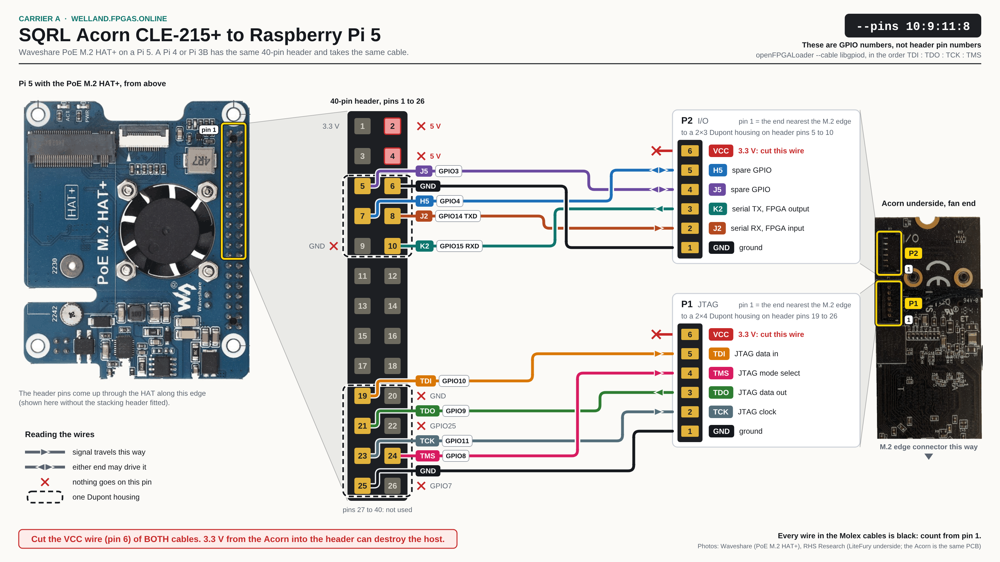
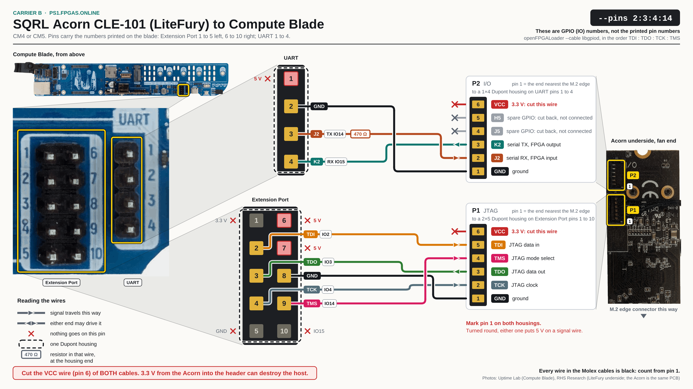

# Acorn wiring

How a SQRL Acorn CLE-215+ (or a LiteFury/NiteFury) is wired to its Raspberry Pi
host in the fpgas.online fleet. See [SQRL Acorn and LiteFury](index.md) for the
board itself and where each one is deployed.

The wiring depends on the **carrier the Pi sits in** — how many GPIOs it brings
out — not on the site:

- **[Raspberry Pi 5 with an M.2 HAT](#raspberry-pi-5)**: the full 40-pin header
  is available. P2 goes to header pins 5-10 and P1 to header pins 19-26. JTAG
  has its own pins, `--pins 10:9:11:8` (TDI:TDO:TCK:TMS), the serial pair is on
  GPIO14/15, and both spare balls (J5, H5) are wired.
- **[Compute Blade with a CM4 or CM5](#compute-blade)**: the blade brings out
  only GPIO2, 3, 4, 14 and 15. P1 goes to the Extension Port and JTAG is
  `--pins 2:3:4:14`. P2's serial pair goes to the 4-pin UART header, and J5 and
  H5 are not connected. The UART header's TX pin is the same GPIO14 as TMS, so
  the J2 wire has a 470 Ω resistor in it and JTAG always wins.

On both carriers the serial pair lands on the same GPIOs — K2 (FPGA TX) on
GPIO15, J2 (FPGA RX) on GPIO14 — so one set of FPGA pin constraints and one set
of host scripts serves every host.

The wiring sheets and pin tables on this page are generated in
[fpgas.online-test-designs](https://github.com/fpgas-online/fpgas.online-test-designs/tree/main/docs/wiring/acorn)
from a single table, `wiring.toml`, and copied here by
`tools/sync_test_designs.py`. To change the wiring, change that table, not this
page.

:::{warning}
**The VCC (3.3 V) wire of both P1 and P2 must never be connected to the host.**
Cut it back and insulate it. 3.3 V from the Acorn into the header can damage the
Pi.
:::

## Bill of Materials

| Item | Description | Qty |
|------|-------------|-----|
| Sqrl Acorn CLE-215+ | M.2 M-key PCIe FPGA accelerator | 1 |
| Raspberry Pi 5 | 8 GB recommended | 1 |
| M.2 PCIe HAT for RPi 5 | M.2 M-key to RPi PCIe adapter that leaves the 40-pin header usable (the sheet shows a Waveshare PoE M.2 HAT+) | 1 |
| Molex Pico-EZmate cable (6-pin) | [Molex 0369200601](https://www.digikey.fr/en/products/detail/molex/0369200601/10233018) | 1 |
| 2×3 Dupont housing (2.54 mm) + crimp terminals | Pi 5: P2 end | 1 |
| 2×4 Dupont housing (2.54 mm) + crimp terminals | Pi 5: P1 end | 1 |
| 2×5 Dupont housing (2.54 mm) + crimp terminals | Compute Blade: P1 end, over the whole Extension Port | 1 |
| 1×4 Dupont housing (2.54 mm) + crimp terminals | Compute Blade: P2 end, over the whole UART header | 1 |
| 470 Ω resistor, 1/8 W axial | Compute Blade: in series with J2 | 1 |
| Solder + heat shrink | For cable termination | — |

## Board connectors

The Acorn has two 6-pin Molex Pico-EZmate connectors. Both are on the
**underside** of the card (the face without the FPGA and heatsink), side by side
along one long edge at the **fan end**, away from the M.2 edge connector. The
silkscreen beside them reads `I/O` / `P2` and `JTAG` / `P1`; P2 is the one nearer
the end of the card.

Pin 1 of each connector is the end **nearest the M.2 edge connector**, and it is
GND on both:

```{include} generated/acorn-connectors.md
```

Sources: the "Pico-EZmate connectors pinout on Acorn, Nite/LiteFury" legend on
the [LiteX Acorn CLE-215
wiki](https://github.com/enjoy-digital/litex/wiki/Use-LiteX-on-the-Acorn-CLE-215),
and the silkscreen of RHS Research's 14-pin JTAG adapter (GND, TCK, TDO, TMS,
TDI, VCC). The wiki legend names K2 and J2 from the host's side ("UART RX
(K2)"): K2 is the FPGA's transmitter. The JTAG order is confirmed in service by
pi20 at PS1, whose cable was built from that legend; it has not been checked
with a meter on a bare card.

Cut one Pico-EZmate cable (plug at each end) in half to get the P1 and P2
cables, and strip about 3 mm from each wire. **All six wires are black**, so
there is no colour to go by: count positions from pin 1, and buzz each wire
through before crimping.

## Raspberry Pi 5

A Pi 4 or Pi 3B has the same 40-pin header and takes the same cable.

[](generated/acorn-wiring-pi5.svg)

### P2: serial pair and spare GPIOs

P2 goes to a 2×3 Dupont housing on header pins 5-10. The cavity over pin 9
(GND) stays empty.

```{include} generated/acorn-pi5-p2.md
```

The serial pair is a **null-modem crossover**: the FPGA's transmitter (K2) lands
on the Pi's receiver (GPIO15 / RXD0) and the FPGA's receiver (J2) on the Pi's
transmitter (GPIO14 / TXD0). This is the Raspberry Pi header convention that
`/dev/ttyAMA0` uses on every Pi generation, and the one the NeTV2 boards use
([NeTV2 primary UART](../netv2.md#primary-uart-via-rpi-gpio)). How firmly the
host holds to it:

- **BCM2711 / BCM2837 hosts (Pi 3, Pi 4, CM4):** the PL011 mux is fixed —
  GPIO14 can only be a UART transmitter and GPIO15 only a receiver — so the
  crossover is the one wiring that works.
- **RP1 hosts (Pi 5, CM5):** the hardware UART0 is only offered as GPIO14 =
  `TXD0`, GPIO15 = `RXD0` (`pinctrl funcs 14,15` lists no alternative where they
  swap). The RP1's PIO block (`/dev/pio0`, the `rp1_pio` module) could run a
  UART on any pin, but no driver for that exists in the test scripts, so the
  fleet uses the crossover everywhere and one cable design works on every host.

| Parameter | Value |
|-----------|-------|
| Device    | `/dev/ttyAMA0` |
| Baud rate | 115200 |
| Pre-test  | `systemctl stop serial-getty@ttyAMA0` (inactive on the fleet) |

**A Pi 5 needs an explicit overlay for this UART.** `bcm2712-rpi-5-b.dtb` ships
the RP1 header UART (`serial0`) disabled, and `dtoverlay=disable-bt`, which frees
the header UART on a Pi 0-4, only touches Bluetooth on a Pi 5. Without
`[pi5] dtoverlay=uart0-pi5` in `config.txt` there is no `/dev/ttyAMA0`.
Enabling it also makes `console=serial0` resolve to `ttyAMA0`, which would put
the kernel console on the FPGA's serial pins (see [Kernel console on the FPGA
UART](#kernel-console-on-the-fpga-uart)), so the Pi 5s use
`console=ttyAMA10`, the dedicated debug connector, via `[pi5]
cmdline=cmdline-pi5.txt`. The Welland NFS root sets both, and its
`verify-pi.yml --tags uart` play checks them; see also [Raspberry
Pi 5](../../setup/pi.md#raspberry-pi-5).

:::{warning}
**Never drive a Pi GPIO against an FPGA output.** With the pin-ID design loaded
every P2 ball is an FPGA *output*, J2 included, so setting GPIO14 to `a4`
(TXD0) or `op` while pin-ID runs is output against output on the J2 wire, and it
crashes the Pi. Probe with `pinctrl set 14 ip pn` (input, no pull), and restore
`pinctrl set 14 a4` only once a design that treats J2 as an input is loaded.
:::

### P1: JTAG

P1 goes to a 2×4 Dupont housing on header pins 19-26. The cavities over pins 20
(GND), 22 (GPIO25) and 26 (GPIO7) stay empty.

```{include} generated/acorn-pi5-p1.md
```

JTAG uses the Pi's SPI0 pins. On a Pi 0-4 unload the SPI modules first
(`rmmod spidev spi_bcm2835`); on a Pi 5 `pinctrl` shows GPIO8-11 unclaimed even
with the modules loaded, so it is not needed there.

**On a Pi 5 the 40-pin header is `/dev/gpiochip15`.** The Welland NFS root ships
`openfpgaloader-rp1pio` (openFPGALoader 1.1.1, from
[mithro/rp1-jtag](https://github.com/mithro/rp1-jtag)). Its `libgpiod` cable
always opens `/dev/gpiochip0` and fails with `JTAG init failed with: Unable to
open gpio chip`, so link the chip first (devtmpfs, so the link goes at reboot):

```console
$ sudo ln -sfn /dev/gpiochip15 /dev/gpiochip0
```

Its `rp1pio` cable (RP1 PIO-driven JTAG) needs `/dev/pio0`, which these hosts do
not have (`rp1-pio: failed to contact RP1 firmware`), so use `libgpiod`. The
build has `--read-dna`, `--read-xadc` and `--read-register`, all read-only. The
PS1 blades run openFPGALoader 0.13.1, which has the same three.

`--detect` is read-only and safe against a live PCIe endpoint. Loading a
bitstream is not: [detach the PCIe endpoint
first](pcie-programming.md#detach-the-pcie-endpoint-before-any-jtag-reconfiguration).

## Compute Blade

The [Compute Blade](https://computeblade.com/) for a CM4 or CM5 does not have
the 40-pin header.

[](generated/acorn-wiring-computeblade.svg)

| Connector | GPIOs | Pins |
|-----------|-------|------|
| Extension Port (2×5) | GPIO2, GPIO3, GPIO4, GPIO14, GPIO15 | printed 1-10 |
| UART (1×4), beside the Extension Port | GPIO14, GPIO15 | printed 1-4 |
| UART Front (3-pin) | GPIO14, GPIO15 | TX, RX, GND |
| Fan Unit (4-pin) | GPIO12, GPIO13 | PWM0/UART5-TX, PWM1/UART5-RX |

GPIO14 and GPIO15 are the same lines at every connector that carries them: the
vendor's [GPIO table](https://docs.computeblade.com/blade/guides/gpio) lists
GPIO14 at "Expansion Module Port, UART Front(3pin), UART Back(4pin)" as "UART0
TX", and GPIO15 at the same three as "UART0 RX". The vendor publishes no
schematic, so whether anything sits in series between the connectors is not
known. GPIO8-11 (SPI0) are not brought out. GPIO2 and GPIO3, which carry TDI and
TDO here, are also SDA1 and SCL1 and have the blade's I²C pull-ups on them.

### Pin numbering

The blade prints its own numbers: **1 to 5 down the left column of the Extension
Port, 6 to 10 down the right**, and 1 to 4 from the top on the UART header (the
vendor's "UART Back"). They are not Raspberry Pi header numbers, although the
Extension Port's ten pins are electrically RPi header pins 1-10 in the same
arrangement. This page uses the printed numbers, because those are the ones in
front of you at the bench. The legend above the Extension Port is spelled
"Extention Port" on the board. TX and RX on the UART header are named from the
blade's side.

```{include} generated/acorn-blade-ext.md
```

```{include} generated/acorn-blade-uart.md
```

The UART header's 5 V pin can be an input or an output (vendor note), so it is
live whenever the blade is powered.

### P1: JTAG, on the Extension Port

```{include} generated/acorn-blade-p1.md
```

### P2: serial pair, on the UART header

```{include} generated/acorn-blade-p2.md
```

Cut the J5 and H5 wires back and insulate them like VCC: the blade's five GPIOs
are JTAG's four plus the serial pair's second line, so none is left for them.
The fpgas.online Acorn design resets J5 and H5 to inputs, so the open ends do no
harm.

### Housings

P1 goes to a 2×5 Dupont housing over the whole Extension Port, and P2 to a 1×4
over the whole UART header. The unused cavities stay empty: Extension Port 1, 5,
6, 7 and 10, and UART 1. No cavity holds two wires.

Use full-length housings, not the shortest that holds the wires. A 2×3 on
Extension Port rows 2-4 also fits one row higher, which puts the GND wire on
pin 7 (5 V); a 1×3 on UART pins 2-4 also fits one pin higher, which puts GND on
UART pin 1 (5 V). Either shorts the blade's 5 V rail, because the Acorn's ground
is the blade's ground through the M.2 slot. A full-length housing has only one
position, but it can still go on turned round — the 2×5 then puts TCK on pin 7,
the 1×4 puts K2 on pin 1, both 5 V — so **mark pin 1 on each housing** and
match it to printed pin 1.

:::{warning}
**Extension Port pins 6 and 7 and UART pin 1 are 5 V and sit inside a housing.
Their cavities must stay empty.**
:::

### The shared line and the 470 Ω resistor

UART pin 3 *is* GPIO14, which is also Extension Port pin 9, where P1 puts TMS.
The blade brings out five GPIOs and JTAG needs four, so one JTAG signal has to
share a line with the serial pair: J2 and TMS share GPIO14.

The TMS wire goes straight to its pin. The J2 wire reaches the same line through
a 470 Ω resistor fitted at the housing end of the wire. Whatever a loaded design
does with J2, TMS still gets through: the worst case is an FPGA output fighting
the JTAG driver through 470 Ω, 3.3 V / 470 Ω ≈ 7 mA, which both the Artix-7 I/O
and the Pi's GPIO tolerate, and the direct driver wins the level. Without the
resistor the same fight is a short between two outputs, which crashes the host
(see the warning under [P2](#p2-serial-pair-and-spare-gpios)). K2 needs no
resistor: GPIO15 is not a JTAG pin on this carrier.

JTAG and the running design do not use the line at the same moment in normal
use: JTAG loads the FPGA, openFPGALoader exits, and only then does the host open
`/dev/ttyAMA0`. The fpgas.online Acorn design only ever receives on J2.

:::{todo}
The resistor value is a design choice, not a measurement. On the first blade
wired this way, confirm that `--detect` answers while a design drives J2, and
that `/dev/ttyAMA0` still transmits through the resistor.
:::

:::{warning}
**On a cable without the J2 resistor, a design that drives J2 costs you JTAG**
([test-designs issue
#4](https://github.com/fpgas-online/fpgas.online-test-designs/issues/4) item 1):
GPIO14 is TMS, and once the FPGA drives it `openFPGALoader` cannot. The pin-ID
design drives every P2 ball, so it does this every time. The way back is a PoE
cycle of the blade's switch port, which restores everything in about 60 s: the
flash bitstream reloads and `--detect`, the DNA read and the PCIe endpoint all
come back. See [PoE power control](../../setup/network.md#poe-power-control) and,
for the PS1 blades, [Power control](../../sites/ps1.md#power-control). Which
blades have the resistor is on [Compute blades](../../sites/ps1.md#compute-blades).
:::

### JTAG on a blade

```console
# Compute Blade JTAG pin order: TDI(GPIO2):TDO(GPIO3):TCK(GPIO4):TMS(GPIO14)
$ openFPGALoader --cable libgpiod --pins 2:3:4:14 --detect
$ openFPGALoader --cable libgpiod --pins 2:3:4:14 <bitstream.bit>
```

Detach the PCIe endpoint first here too. The bus address differs per blade, so
take it from [Compute blades](../../sites/ps1.md#compute-blades).

openFPGALoader 0.13.1 leaves GPIO2, GPIO4 and GPIO14 as **outputs** when it
exits. Put them back before anything else uses the shared line:

```console
$ pinctrl set 2,3,4 ip    # JTAG pins back to inputs
$ pinctrl set 14 a4       # GPIO14 = TXD0
$ pinctrl set 15 a4       # GPIO15 = RXD0
$ stty -F /dev/ttyAMA0 115200 raw -echo
```

## Assembly

1. Plug the P1 Pico-EZmate connector into the Acorn's **P1** (JTAG) socket.
2. Plug the P2 Pico-EZmate connector into the Acorn's **P2** (Serial/GPIO) socket.
3. Route the cables so they don't obstruct the M.2 connector or the PCIe edge
   fingers.

On a **Raspberry Pi 5**:

4. Mount the M.2 PCIe HAT onto the Pi.
5. Insert the Acorn into the M.2 M-key slot, push until fully seated, and fit
   the retention screw.
6. Plug the **P2 housing** (2×3) onto header pins 5-10.
7. Plug the **P1 housing** (2×4) onto header pins 19-26.

On a **Compute Blade**:

4. Insert the Acorn into the blade's M.2 slot.
5. Plug the **P1 housing** (2×5) over the whole Extension Port, pin 1 on printed
   pin 1.
6. Plug the **P2 housing** (1×4) over the whole UART header, pin 1 on printed
   pin 1.

Then check that both VCC wires (and on a blade, J5 and H5) are cut back and
insulated, and on a blade that the 470 Ω resistor is in the J2 wire.

**Buzz every wire of the cable through with a meter before connecting.** The six
wires are all black, the two halves of a cut cable have pin 1 on opposite
sides, and nothing on the plug is numbered: pin 1 is the wire that lands nearest
the M.2 edge connector once the plug is seated.

## Verification

The Pi 5 commands are shown; on a Compute Blade use `--pins 2:3:4:14` and the
blade's own PCIe bus address.

### Step 1: PCIe

```console
$ lspci -nn -s 0001:01:00.0
# The factory Sqrl firmware:
#   0001:01:00.0 Processing accelerators [1200]: Squirrels Research Labs Acorn CLE-215+ [1e24:021f]
# The vendor (RHS Research) XDMA sample image:
#   0001:01:00.0 Processing accelerators [1200]: Xilinx Corporation 7-Series FPGA Hard PCIe block (AXI/debug) [10ee:7011]
# The fpgas.online Acorn design (or any LiteX x1 PCIe design):
#   0001:01:00.0 Memory controller [0580]: Xilinx Corporation Device [10ee:7021]
```

If the Acorn doesn't appear, check the M.2 seating and the HAT's FPC cable, and
`dmesg | grep -i pci`.

### Step 2: JTAG

:::{warning}
**Detach the PCIe endpoint before every JTAG reconfiguration.** Reconfiguring
the FPGA while its endpoint is enumerated is a surprise removal that the BCM2712
root complex does not survive: the Pi drops SSH and reboots. With the endpoint
removed first the load completes and the host is unaffected.
:::

```console
# 0. Detach the endpoint (bring it back as in Step 5, or reboot)
$ echo 1 | sudo tee /sys/bus/pci/devices/0001:01:00.0/remove
# Pi 5 only: the libgpiod cable opens gpiochip0, the header is gpiochip15
$ sudo ln -sfn /dev/gpiochip15 /dev/gpiochip0
# 1. Read-only check (safe without step 0)
$ openFPGALoader --cable libgpiod --pins 10:9:11:8 --detect
# Expected: idcode 0x3636093 (XC7A200T)
# 2. Load to SRAM. About 16 s for a 1.6 MB XC7A200T bitstream over libgpiod.
$ openFPGALoader --cable libgpiod --pins 10:9:11:8 <bitstream.bit>
```

Never pass `--write-flash` here: an SRAM load is lost at power-off, so a reboot
restores whatever is in flash, which makes every experiment safe. Writing the
flash is covered in [Acorn PCIe programming and multiboot](pcie-programming.md).

:::{warning}
**Files staged under `/home/pi` do not survive a reboot.** The Pi root is
`overlayroot=tmpfs` on a read-only NFS root. The symptom is openFPGALoader
printing `Open file … FAIL` in under 0.1 s: copy the bitstream again.
:::

### Step 3: UART and GPIO loopback

```console
$ sudo systemctl stop serial-getty@ttyAMA0
$ sudo systemctl mask serial-getty@ttyAMA0
# Load the loopback bitstream (detach PCIe first, see Step 2)
$ openFPGALoader --cable libgpiod --pins 10:9:11:8 gpio-loopback-acorn.bit
# UART (the loopback inverts)
$ stty -F /dev/ttyAMA0 115200 raw -echo
$ echo "test" > /dev/ttyAMA0
# GPIO (the loopback inverts). The header is gpiochip15 on a Pi 5 (line N is GPIO N).
$ gpioset gpiochip15 3=1
$ gpioget gpiochip15 4
# Expected: 0
```

### Step 4: pin ID

```console
$ openFPGALoader --cable libgpiod --pins 10:9:11:8 pmod-pin-id-acorn.bit
# Each ball transmits its own name at 1200 baud. Correctly wired:
# GPIO15 → "K2" (serial TX, on the Pi's RXD0)
# GPIO14 → "J2" (serial RX, on the Pi's TXD0)
# GPIO3  → "J5" (spare GPIO)
# GPIO4  → "H5" (spare GPIO)
# On a Compute Blade only GPIO14 and GPIO15 answer: J5 and H5 are not connected there.
```

Only GPIO15 can be a hardware UART receiver on a Pi 5, so the other three are
decoded from edge timestamps: [the repository's pin-ID host
scanner](https://github.com/fpgas-online/fpgas.online-test-designs/blob/main/designs/pmod-pin-id/host/identify_pmod_pins.py)
requests both-edge events through gpiod (v1 or v2), rebuilds the 1200-baud
frames from the kernel timestamps (833 µs per bit against nanosecond stamps),
and finds the header chip by label, so it works on a Pi 5. `gpiomon` edge
timestamps decoded by hand work the same way. Do not sample the pins by polling
from Python: polling mis-frames the bytes even on a clean signal. Keep GPIO14 an
input throughout (see the warning under [P2](#p2-serial-pair-and-spare-gpios)).
Check the method on a positive control before trusting a negative: drive a
spare Pi GPIO and confirm the monitor sees it. The design is described under
[Verifying wiring with the pin-id design](../pin-id.md).

A passive check needs no bitstream: toggle the Pi's internal pull-up, then
pull-down, on each line and see whether the line follows. A ~50 kΩ internal pull
loses to any real driver, so a line that follows is floating (the far end is an
FPGA input: J2) and one that stays put is driven (an FPGA output: K2). It cannot
read GPIO2 or GPIO3, which carry I²C pull-ups. The same test shows whether P1 is
mated: the Acorn pulls TCK up, so a TCK line that the Pi's pull-down cannot
move has the card on the end of it, and one that follows has nothing.

### Step 5: PCIe design

```console
$ echo 1 | sudo tee /sys/bus/pci/devices/0001:01:00.0/remove   # detach first
$ openFPGALoader --cable libgpiod --pins 10:9:11:8 pcie-acorn.bit
# A rescan is not enough for a LiteX design: re-probe the slot's root complex
$ echo 1000110000.pcie | sudo tee /sys/bus/platform/drivers/brcm-pcie/unbind
$ echo 1000110000.pcie | sudo tee /sys/bus/platform/drivers/brcm-pcie/bind
$ lspci -nn -d 10ee:
# Expected: Xilinx Corporation Device [10ee:7021] (LitePCIe's default for one lane)
```

Why the re-probe is needed is under [Bring the endpoint back after a JTAG
load](pcie-programming.md#bring-the-endpoint-back-after-a-jtag-load).

## Kernel console on the FPGA UART

:::{warning}
**The kernel console must not be on the FPGA's UART.** If a host's kernel
command line puts it there (`console=ttyAMA0`, or `console=serial0` on a Pi 5
with `uart0-pi5` enabled), loading any design that drives serial TX — the UART
SoC, pin-ID, the GPIO loopback — reboots or crashes the host. Every fleet host
boots with `console=tty1` (Compute Blades) or `console=ttyAMA10` (Pi 5s); check
this on any new host.
:::

The FPGA drives K2 at its own baud rate (1200 for pin-ID, 115200 for the UART
SoC), and the kernel console reads the bytes as garbage, some of which are
**SysRq commands** — `reboot(b)`, `crash(c)`, `poweroff(o)`,
`kill-all-tasks(i)`. Apply both:

1. Keep the console off the FPGA UART: `console=tty1` on a Compute Blade;
   `console=ttyAMA10` (the debug connector) on a Pi 5, via `[pi5]
   cmdline=cmdline-pi5.txt`, so the getty systemd derives from the console lands
   there too.
2. Disable SysRq: `kernel.sysrq=0` on the kernel command line or in
   `/etc/sysctl.d/`.

Tracked in [fpgas-online/todo#22](https://github.com/fpgas-online/todo/issues/22)
and [test-designs
issue #3](https://github.com/fpgas-online/fpgas.online-test-designs/issues/3).

## Troubleshooting

| Problem | Likely cause | Fix |
|---------|--------------|-----|
| Acorn not on PCIe | M.2 not seated, FPC cable loose | Reseat the M.2 card, check the FPC |
| JTAG programming fails | SPI modules loaded, wrong pins | `rmmod spidev spi_bcm2835`, check the pin order |
| `JTAG init failed with: Unable to open gpio chip` (Pi 5) | The `libgpiod` cable opens `/dev/gpiochip0`; the header is `gpiochip15` | `ln -sfn /dev/gpiochip15 /dev/gpiochip0` |
| `--detect` says `found 0 devices` but PCIe enumerates | P1 (JTAG) cable unmated or miswired | Check TCK for the Acorn's pull-up; reseat P1 |
| Pi reboots or SSH drops during a JTAG load | FPGA reconfigured while its PCIe endpoint was enumerated | `echo 1 > /sys/bus/pci/devices/0001:01:00.0/remove` before loading |
| `Open file … FAIL` in < 0.1 s | The bitstream is gone: `/home/pi` is a tmpfs overlay, lost at reboot | Copy the file again |
| Pi crashes the instant a GPIO is set to output | Contention with an FPGA output on the same wire (pin-ID drives all four P2 balls) | Keep GPIO14 an input (`pinctrl set 14 ip pn`) while pin-ID runs |
| No `/dev/ttyAMA0` on a Pi 5 | RP1 uart0 disabled; `disable-bt` does not enable it on bcm2712 | `[pi5] dtoverlay=uart0-pi5` |
| No UART output | serial-getty holding the port, wrong baud, or K2/J2 not crossed over | Mask serial-getty, use 115200, run pin-ID and check GPIO15 reads `K2` |
| Pi reboots when a serial design loads | Kernel console on the FPGA UART; SysRq | Console to `ttyAMA10` (Pi 5) / `tty1` (blade), `kernel.sysrq=0` |
| GPIO pins don't respond | Cable wired incorrectly | Buzz each wire from its Pico-EZmate position (pin 1 = GND, nearest the M.2 edge) to the pin in the tables above |
| PCIe device missing after loading a design | A LiteX design needs PERST#; a rescan alone does nothing | Re-probe the slot's root complex ([procedure](pcie-programming.md#bring-the-endpoint-back-after-a-jtag-load)); if it still does not link, check the build's I/O report has the lane on B10/B6 |
| JTAG fails on a Compute Blade | Wrong pin order | Use `--pins 2:3:4:14`, not `--pins 10:9:11:8` |
| UART dead after JTAG on a Compute Blade | openFPGALoader left GPIO14 a plain output | `pinctrl set 14 a4` (and `pinctrl set 2,3,4 ip`), then open `/dev/ttyAMA0` |
| Board hung, ~0.4 W on PoE instead of ~8 W | Wedged Pi 5 | PoE cycle the switch port; a Pi 5 needs over 90 s to come back |

## Compatible boards

All variants share the PCB layout and pin assignments, so this wiring applies
unchanged to each of them; the list is under [Compatible
boards](index.md#compatible-boards).

## References

- Board spec: [SQRL Acorn and LiteFury](index.md)
- Wiring source: [fpgas.online-test-designs `docs/wiring/acorn/`](https://github.com/fpgas-online/fpgas.online-test-designs/tree/main/docs/wiring/acorn)
- LiteX wiki: [Use LiteX on the Acorn CLE-215](https://github.com/enjoy-digital/litex/wiki/Use-LiteX-on-the-Acorn-CLE-215)
- LiteX platform: [sqrl_acorn.py](https://github.com/litex-hub/litex-boards/blob/master/litex_boards/platforms/sqrl_acorn.py)
- NiteFury/LiteFury: [RHSResearchLLC/NiteFury-and-LiteFury](https://github.com/RHSResearchLLC/NiteFury-and-LiteFury)
- OpenOCD flashing: [NiteFury/Acorn flashing guide](https://github.com/Gbps/nitefury-openocd-flashing-guide)
- Molex Pico-EZmate cable: <https://www.digikey.fr/en/products/detail/molex/0369200601/10233018>
- Compute Blade: <https://computeblade.com/>
- Compute Blade GPIO docs: <https://docs.computeblade.com/blade/guides/gpio>
- Compute Blade GitHub: <https://github.com/uptime-lab/compute-blade>
