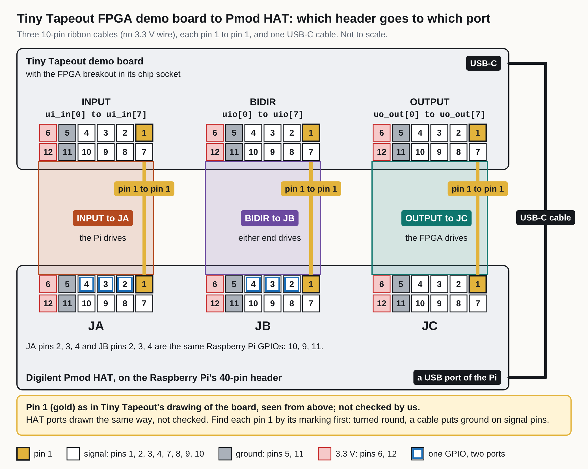

# Tiny Tapeout FPGA board on a Raspberry Pi: building overview

**You have a Tiny Tapeout FPGA demo board, a Raspberry Pi and a Digilent Pmod HAT, and want to join them,
check that the wiring is right, and know what it takes for the board to be on the public site.**

**This guide is not yet a full procedure.** It holds what is recorded about how the boards at welland are put
together; nothing in it was written from an assembly we watched. Each step that has no procedure or no
picture says so in place. Not yet run by us on this hardware as a guide.

## The cables: 10-pin ribbon, no 3.3 V wire

**On our boards each cable is a female-to-female 10-pin ribbon cable, joined to the 12-pin socket at each
end through a strip of pin header, with the 3.3 V pin left out: pins 6 and 12 are not carried, so the two
boards' 3.3 V supplies are not joined.** The boards' owner, Tim Ansell, said so on 7 October 2026. He
believes the cables are whiteeeen 10-pin flat ribbon cables (0.1 inch pitch, about 200 mm, IDC
connectors; Amazon product B094RGMBS9); that is his belief, not checked by us. **How the 10-pin cable sits
on the 12-pin socket (which end of the socket is left free) is not recorded**, so find pin 1 on both
connectors before plugging a cable in. Every other page that touches the cables points here.

What the makers' documents, Tim's answer and our cameras say about the cables. The line about a straight
twelve-wire cable says what such a cable would do: it is not an instruction to use one.

```{include} ../generated/tt-fpga-cables.md
:start-after: "**The cables**"
:end-before: "On a Pmod connector pins 1 to 6"
```

## What you will have

Each RPi connects to a TT FPGA board via USB-C, has a Digilent
[Pmod HAT](../../pmod/rpi-hat.md) for GPIO-level control of the TT I/O pins, and an
ov5647 camera publishing a live feed of the board. RPis are powered and
networked through PoE switches at each site. The camera and the power are not in the picture below, which
shows the Pmod cables and the USB-C cable only.

[](../generated/tt-fpga-pmod-cables.svg){.only-light}
[](../generated/tt-fpga-pmod-cables-dark.svg){.only-dark}

Three 10-pin ribbon cables, their 3.3 V pin left out, each pin 1 to pin 1 (INPUT to JA, BIDIR to JB, OUTPUT
to JC), and one USB-C cable
from the demo board to a USB port of the Raspberry Pi.

## The order of work

```{toctree}
:maxdepth: 1

What is known about the parts <bom>
Fitting: power off, the HAT, the cables, power on, the camera <fitting>
Verifying 1: install and run the check <verifying-1>
Verifying 2: from a failing line to the cable <verifying-2>
```

## From a passing board to the public site

**A board on a Pi of your own is not on tinytapeout.fpgas.online, and nothing in this guide puts it there.**
What the records say the site needs:

1. **The Pi boots the fleet's root.** The site's boards are on Pis that boot fpgas.online's shared root over
   the network at a site of ours ([Tiny Tapeout FPGA boards at welland](../installations/welland.md)); the
   boot check runs in it at every boot.
2. **The boot check reports the board.** Each Pi's boot check reports which board it carries and what that
   board is, by the board's USB serial number, in its `fpga-verified` report, and the site follows that
   report ([Events](../../../verify/fpgas-verify.md#events), another page, not in this set).
3. **The site's list gives it a name, if it has a row.** The site's list of Tiny Tapeout boards, `tt_boards`
   in fpgas.online-infra, names each board by its `usb_serial` and gives it a page address, a title and a
   description. A board that is in no row is shown all the same, at `/board/tt-<usb serial>/` (the list's own
   comment in `ansible/inventory/host_vars/fpgas.online.yml` of fpgas.online-infra, read on 7 October 2026).

Whom to ask: the operator of the site, who keeps that list and the Pis that boot the fleet's root.
